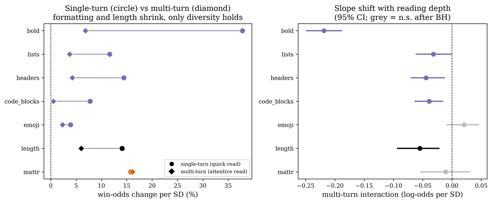
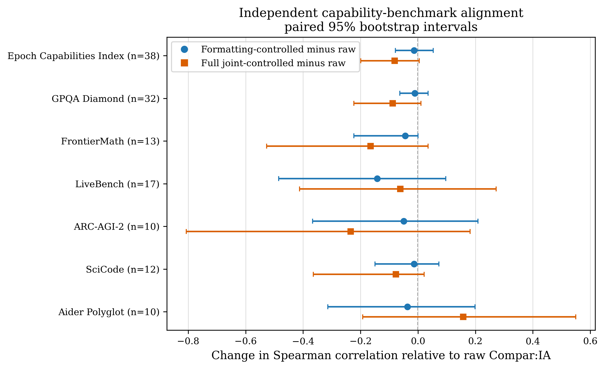

# What Wins a Vote? Formatting, Length, and Lexical Diversity in the French Compar:IA LLM Arena

---

## Abstract

LLM arenas turn pairwise human preferences into model rankings. Those preferences may reflect how an answer is presented as well as what it says. We analyse 137,293 decisive French-language votes from the July 2026 Compar:IA release; the primary formatting analysis includes 137,113 battles across 116 models, and the joint estimates use the 127,092 battles with all required measurements. For each battle, we reconstruct the response visible when the user voted. We then compare the raw ranking with rankings adjusted for formatting, length, readability, vocabulary variety, and sentence structure. Presentation is associated with winning, but length, bold text, and lists tend to occur together, making their individual contributions hard to separate. Two signals remain comparatively stable when all measured features are included: **bold usage** (+11.0% win odds per standard deviation) and **vocabulary variety measured with a metric that is less sensitive to answer length** (+16.8%). The full adjustment moves 36 of 116 models by at least ten ranks. Yet comparisons with external benchmarks do not show that adjusted rankings better measure capability. These are observational associations, not estimates of what would happen if the same answer were reformatted. We therefore recommend publishing raw and adjusted rankings side by side.

---

## 1. Introduction

LLM evaluation arenas show users two anonymous responses and ask which they prefer. The resulting rankings measure human preference. They do not directly measure factual accuracy or technical capability. Compar:IA, a French government-backed arena launched publicly in October 2024, describes its ranking in the same terms (Compar:IA, 2026a).

This distinction matters because users may respond to presentation as well as substance. Previous studies have found preferences related to response position, length, verbosity, and errors, although the pattern depends on whether the evaluator is a person, an LLM judge, or a reward model (Zheng et al., 2023; Singhal et al., 2024; Saito et al., 2023; Dubois et al., 2024; Wu & Aji, 2025). Li et al. (2024) addressed this problem in LMArena by adding response length and markdown features to its ranking model. The adjusted ranking changed, but the study could not determine whether style was a bias or a genuine signal of answer quality.

We extend that analysis beyond markdown and length. We study three groups of observed response properties: **formatting** (bold, lists, headers, code, and emoji), **length**, and **language** (readability, vocabulary variety, and sentence structure). These properties often travel together: longer answers, for example, tend to contain more lists and bold text. We estimate them jointly to ask which associations remain after accounting for the other measured properties and for the model that produced each response.

Compar:IA offers about 137,000 decisive French-language votes across 116 models. It also records the turn at which the vote occurred, which allows us to exclude later conversation turns from every measurement. Its broad model roster lets us distinguish patterns that arise because different models have different presentation habits from patterns observed across answers by the same model.

We ask two questions: **Which aspects of presentation remain associated with votes after the other measured properties are taken into account? How much do those adjustments change the ranking?** Our analysis makes three contributions. First, it estimates formatting, length, and language in one ranking model and shows that many of their associations overlap. Second, it identifies bold usage and comparatively length-robust vocabulary variety as the two most stable signals. Third, it reconstructs every response as it appeared at the time of the vote, then tests whether the associations differ between single-turn and multi-turn conversations. Finally, we compare the resulting rankings with external leaderboards to test, rather than assume, that adjustment brings arena rankings closer to independent capability measures.

---

## 2. Data

### 2.1 The Compar:IA Platform

Compar:IA is an LLM evaluation arena operated by the French government's Ministry of Culture and Direction interministérielle du numérique (DINUM). Users submit prompts and receive responses from two anonymous models side-by-side, may continue the conversation over several turns, and then vote for a winner or declare a tie. Models are identified only after voting.

The platform offers several arena modes; in our data the decisive votes come from **random** (72%, random model pairs), **custom** (19%, user-selected pairs), **big-vs-small** (8%, deliberately pairing large and small models), and **small-models** (2%).

### 2.2 Dataset

We use **`ministere-culture/comparia-fr-arena`** (Compar:IA & Ministère de la Culture, 2026b), the consolidated Compar:IA release published on Hugging Face under Open Licence 2.0 (Etalab) and CC-BY-4.0. We pin revision **`8cd6488c5d0c3b8dfcb9339d11ae9624c84359be`** (published and accessed 8 July 2026). The gated release contains 641,277 turn rows and roughly 208K human reactions across 115+ models before our French/decisive filtering. It is organised by turn: one row per conversation turn, and `choice` records any reaction made on that turn. A small number of conversations contain multiple decisive reactions; we retain the last decisive reaction per `comparison_id`, yielding one battle per conversation.

| | Raw turns | Decisive French battles | Models (≥100 battles) |
|---|---:|---:|---:|
| comparia-fr-arena | 641,277 | 137,293 | 116 |

Ties and no-vote turns are dropped (decisive votes only, matching prior style-control work). Winner distribution is balanced (model A wins 49.9%, see §4.4).

### 2.3 Feature extraction and data quality

For each battle, we reconstruct only the text visible when the vote was cast. We concatenate the assistant messages up to that point and sum the release's per-turn token counts over the same period. We do not use token totals for the completed conversation. We then compute formatting and language features on this vote-time text. Battles with no visible response text at the vote are dropped.

The release can store hidden reasoning separately in `reasoning_content` or embed it in a paired `<think>...</think>` span before the final answer. We never analyse `reasoning_content`. For embedded spans, we remove each complete span and retain only text outside it; if a tag is unmatched, we retain only the unambiguous text before it. Relative to the earlier all-or-nothing tag filter, this rule newly retains 86 battles with visible final text and removes 7 ambiguous legacy cases, for a net increase of 79. A versioned aggregate audit (`results/reasoning_content_audit_results.json`) of the pinned release found no retained decisive French vote prefix whose last assistant message had empty final `content` but non-empty `reasoning_content`. We therefore find no evidence of that directly observable missing-final-answer failure mode in the renewed release. An untagged reasoning trace stored in `content` cannot be identified from these fields alone, so it cannot be ruled out.

Topic comes from the release metadata, and conversation depth is the number of user turns visible at the vote. Coverage is high: topic is present for 100% of battles, length for 99.9%, and language features for 97.2%.

### 2.4 Native Topic Metadata and Vote-Timing Audit

Each conversation has an LLM-assigned topic from about 18 subject classes, which we use in §4.7. It also records when each reaction occurred. Some source conversations continued after the retained vote: this happened in **15,357 of 137,293 battles (11.2%)**. Those later turns are excluded from the response text, token counts, and depth measures. At the time of voting, 15,552 battles were genuinely multi-turn. An independent audit against the raw release found that no post-vote turn entered any measured feature.

---

## 3. Methodology

### 3.1 Presentation Features

We measure presentation in three families, all computed per response.

**Formatting**, five markdown features:

| Feature | Description | Regex Pattern |
|---------|-------------|---------------|
| **Headers** | Markdown headers (# through ######) | `^#{1,6}\s` (multiline) |
| **Lists** | Ordered and unordered list items | `^\s*[-*+]\s` and `^\s*\d+\.\s` |
| **Bold** | Bold-formatted text | `\*\*[^*]+\*\*` |
| **Code blocks** | Fenced code blocks | ` ``` ` or `~~~` (counted in pairs) |
| **Emoji** | Emoji characters | Unicode emoji ranges |

**Length**, the response's cumulative output-token count from the dataset metadata.

**Language**, covering properties beyond formatting: readability (Kandel-Moles REL, calibrated for French; Coleman-Liau; Flesch-Kincaid grade), lexical diversity, and sentence structure (Kandel & Moles, 1958; Coleman & Liau, 1975; Kincaid et al., 1975). We use two diversity measures. Type-token ratio (TTR) is the number of unique words divided by the total number of words, so it tends to fall as answers get longer. Moving-average type-token ratio (MATTR) computes the same ratio within rolling 50-token windows and is less dependent on total length (Covington & McFall, 2010).

Sections 4.1 to 4.4 first reproduce a narrow formatting analysis that is structurally similar to prior style control. Section 4.5 then adds length and all language features. We separate these specifications because length may reflect genuine completeness as well as presentation. Controlling for it can therefore remove useful quality signal, not just bias. Our coefficients are not numerically comparable with Li et al. (2024), who standardise a relative feature difference, while we standardise the raw difference between responses A and B.

### 3.2 Bradley-Terry Model

We use a Bradley-Terry (BT) model, a standard method for turning pairwise wins and losses into model ratings (Bradley & Terry, 1952). The basic model asks how strongly each model's identity predicts a win. The controlled model also compares the presentation of the two responses. It therefore estimates how the ranking changes after accounting for measured presentation differences.

**Standard model.** For each decisive battle, the outcome is 1 when model A wins and 0 when model B wins. Model A receives +1 and model B receives −1 in the corresponding model columns. We fit logistic regression without regularisation. The all-model contrast design is identified only up to an additive constant, so after fitting we recenter the model coefficients to sum to zero. This makes the mean rating 1000 without changing any pairwise prediction:

$$\text{Rating}_i = 1000 + \frac{400 \cdot \beta_i}{\ln(10)}$$ 
(Zheng et al., 2023)

**Style-controlled model.** We add the difference between responses A and B for each presentation feature. These differences are standardised, so a coefficient represents the association with a one-standard-deviation difference:

$$P(\text{A wins}) = \sigma\left(\sum_i \beta_i \cdot \mathbb{1}_i + \sum_f \gamma_f \cdot \Delta f\right)$$
(Dubois et al., 2024)


Here, $\beta_i$ represents the remaining preference for model $i$ after measured presentation is included; it should not be read as pure skill. The $\gamma_f$ terms describe the remaining association between each measured feature and the vote. Including a coefficient for every model means that these feature associations are estimated after accounting for stable differences between models. The primary formatting-only analysis in §§4.1–4.4 uses standardised raw contrasts. The joint, conversation-depth, and topic-interaction models cap each feature contrast at its 1st and 99th percentiles before standardising so that a few unusual battles do not dominate those estimates. The exploratory task-stratified fits follow the raw-contrast formatting specification.

### 3.3 Bootstrap Inference

Primary coefficient and model-rating intervals use 1,000 nonparametric bootstrap samples of battles drawn with replacement (Efron, 1979). The exploratory topic and task strata use 400 samples, the weekly block sensitivity analysis uses 500 samples, and external paired-correlation comparisons use 10,000. Battle-level resampling treats battles as independent and cannot account for repeated users or other latent clustering. Weekly resampling is a temporal sensitivity analysis, not a substitute for user-level clustering.

### 3.4 Multiple Comparison Correction

Because we test several features and model-rating changes, we apply the Benjamini-Hochberg procedure at 0.05 to limit false discoveries (Benjamini & Hochberg, 1995). We correct the five primary formatting features, the thirteen joint-model features, each conversation-depth interaction family, and per-model rating changes as separate families. Rank changes are descriptive and are not tested separately. Topic- and task-stratified intervals are unadjusted exploratory intervals and are described as such.

---

## 4. Results

### 4.1 Formatting and Votes

Bold has the largest formatting association with votes. Table 1 reports each feature after accounting for model identity and the other formatting features.

**Table 1. Style coefficients from the Bradley-Terry model (137,113 battles, 116 models). p-values are BH-adjusted across 5 tests.**

| Feature | % Odds Change | 95% CI | p (BH) | Significant? |
|---------|--------------:|--------|--------|-------------|
| **Bold** | **+19.0%** | [+16.0%, +22.4%] | 0.002 | Yes |
| **Headers** | +9.1% | [+3.0%, +12.6%] | 0.002 | Yes |
| **Lists** | +6.6% | [+4.5%, +9.0%] | 0.002 | Yes |
| **Emoji** | +3.5% | [+1.5%, +5.4%] | 0.002 | Yes |
| Code blocks | +0.8% | [−0.8%, +4.5%] | 0.580 | No |

**Interpretation.** A one-standard-deviation difference in bold usage is associated with 19.0% higher win odds, after adjusting for model identity and the other formatting features. Headers, lists, and emoji have smaller but significant associations; code blocks show no detectable pooled association. Bold is the strongest formatting correlate in this specification.

### 4.2 Formatting Features Share the Same Signal

The formatting features overlap. When each is tested alone, it receives credit for patterns that it shares with the others, so every estimate is larger.

**Table 2. Ablation: single-feature style control (odds change per SD).**

| Feature | Alone | Joint (Table 1) |
|---------|------:|----------------:|
| Bold | +27.0% | +19.0% |
| Headers | +22.3% | +9.1% |
| Lists | +16.8% | +6.6% |
| Emoji | +8.8% | +3.5% |
| Code blocks | +4.8% | +0.8% |

Every coefficient shrinks when the other features are added, in some cases sharply. The data therefore cannot cleanly separate the associations of features that often appear together.

### 4.3 How Much the Ranking Changes

The correlation between standard and formatting-controlled BT ratings is **r = 0.985**: rankings are stable overall, but specific models shift. Across all 116 models, **87 (75%)** show a statistically significant rating change after style control.

**Table 3. Largest rank changes after formatting control. “Sig?” refers to the BH-adjusted test of the underlying rating change.**

| Model | Std → Ctrl | ΔRank | Sig? |
|-------|:----------:|------:|------|
| mistral-small-2603 | 9 → 33 | **−24** | Yes |
| qwen-3-8b | 80 → 102 | **−22** | Yes |
| mistral-large-2512 | 3 → 24 | **−21** | Yes |
| gpt-oss-120b | 37 → 56 | **−19** | Yes |
| gpt-5.3 | 45 → 27 | **+18** | Yes |
| qwen3-30b-a3b | 78 → 95 | **−17** | Yes |
| mistral-medium-2508 | 2 → 15 | **−13** | Yes |
| o4-mini | 76 → 63 | **+13** | Yes |
| qwen3-32b | 54 → 68 | **−14** | Yes |

Heavy formatters (mistral-large-2512, mistral-small-2603, gpt-oss-120b) fall, while several more concise models rise. These shifts establish sensitivity to the adjustment; they do not by themselves show that the models which rise have greater reasoning depth or substantive quality.

### 4.4 Position Bias and Arena Modes

Position bias is negligible and not significant: model A wins 49.94% of decisive battles (binomial p = 0.67). Win rates are close to 50% within every arena mode (random 49.9%, custom 50.1%, big-vs-small 49.6%, small-models 50.7%). This is cleaner than the older export, which carried a small but significant A-side bias, and reflects the balanced construction of the consolidated release.

### 4.5 Adding Length and Language

Adding length and language features changes the picture: much of the formatting association is shared with answer length, while bold and MATTR remain distinct signals. The retained frame has 137,293 battles. The primary formatting analysis excludes 180 battles involving three models below the 100-battle threshold, leaving 137,113. For the joint analysis, missing readability removes 5,891 battles, missing TTR removes another 187, and missing MATTR removes another 3,950; applying the model threshold then removes 173, leaving **127,092 battles across 116 models**. Length and formatting are complete in the retained frame.

**Some of the formatting association is also a length association.** Longer answers tend to contain more markdown, so adding length makes the formatting estimates smaller. Length itself is associated with +8.3% win odds [+5.7, +10.6]. This does not mean that length is merely a bias, since a longer answer may also be more complete.

**Bold remains associated with votes after all measured features are included.** Among the battles with all required measurements, its formatting-only estimate is +20.4%; after length and language are added it is **+11.0%** [+8.8, +13.6]. Comparing the same battles ensures that the change comes from the added features rather than missing data. Headers are +6.8%, code blocks +2.4%, emoji +3.3%, and lists +1.7%. Lists are not significant after correction; the other four formatting estimates are. The small list estimate also changes across specifications.

**MATTR is the most stable language measure.** A one-standard-deviation increase is associated with **+16.8%** win odds [+14.9, +18.9]. MATTR is nearly unrelated to total length in these data, so it captures something different from simply writing more. Raw TTR is −26.3%, but TTR mechanically falls as text gets longer and should not be interpreted as an independent diversity signal. Taken together, length, markdown density, and raw TTR overlap too much for their individual estimates to have a simple interpretation. MATTR stands apart from that group.

**Readability and sentence length add little.** REL (−0.8%) and Flesch-Kincaid (−3.7%) are not significant. Coleman-Liau is +3.4%, but the three readability measures overlap strongly, so we do not interpret one as uniquely important. Mean sentence length is not significant.


**The added features provide a small gain in in-sample fit.** In-sample battle-classification accuracy rises from 0.634 with formatting alone to 0.637 after adding length and **0.642** in the full model. This descriptive improvement does not measure out-of-sample performance and does not show that presentation caused the votes.

**The joint control reshuffles the leaderboard more than formatting alone.** Among battles with all required measurements, the standard ranking correlates with the formatting-only controlled ranking at r = 0.967 but with the *joint* controlled ranking at only **0.931** (Spearman 0.915); **36 of 116 models move by ≥10 ranks**. Heavy formatters fall (gpt-oss-120b −48, mistral-small-2603 −35, mistral-large-2512 −33, glm-4.5 −29), while concise strong models rise (gpt-5.3 +43, claude-3-5-sonnet-v2 +34, trinity-large-preview +29, claude-3-7-sonnet +28, o4-mini +28).

**Much of the raw pattern comes from differences between models.** Without model controls, the estimates are larger: bold is +29.1%, mean sentence length +23.7%, and MATTR +32.3%. After accounting for which model produced each answer, they fall to +11.0%, +2.3%, and +16.8%. Models that usually present answers differently therefore explain a substantial part of the pooled pattern. The remaining association compares answers after stable model differences are accounted for, but it is still not causal.

### 4.6 Single-Turn and Multi-Turn Conversations

Formatting is less strongly associated with votes in multi-turn conversations, especially for bold. We compare battles with one user turn visible at the vote against those with two or more. Of 137,113 battles in this analysis, 88.7% are single-turn and 11.3% are genuinely multi-turn at the time of voting.

We estimate both groups in one model by allowing each presentation association to change for multi-turn battles. A negative interaction in Table 4 means that the association is smaller in multi-turn conversations. Bold, headers, and code blocks have significant negative interactions after correction; lists does not. Emoji has a small positive interaction.

**Table 4. Formatting association by depth visible at the vote (win-odds change per SD, from the pooled interaction model; single-turn = $e^{\gamma}$, multi-turn = $e^{\gamma+\delta}$).**

| Feature | Single-turn | Multi-turn | Interaction δ | Sig? |
|---------|:-----------:|:----------:|:-------------:|------|
| **Bold** | **+30.1%** | **+7.4%** | −0.191 | Yes |
| Headers | +11.1% | +6.8% | −0.040 | Yes |
| Lists | +9.0% | +7.8% | −0.012 | No |
| Code blocks | +5.0% | +0.8% | −0.041 | Yes |
| Emoji | +2.4% | +6.0% | +0.035 | Yes |

Bold changes the most, from +30.1% win odds in single-turn battles to +7.4% in multi-turn battles, a reduction of about 75% in the pooled interaction model. This is a difference between observed groups, not evidence that longer conversations cause users to discount formatting. Users may continue for reasons related to the prompt, their goals, or the quality of earlier answers.



**Length and lexical diversity change much less.** In the pooled interaction model, length moves from +10.9% to +7.7%, and MATTR from +16.2% to +13.7%; neither interaction is significant after correction. Separate descriptive stratum fits are similar but are not used to derive the interaction test. Section 4.7 shows that allowing observed topic-specific slopes leaves the depth interactions similar; this does not rule out topic-related or unmeasured confounding. Conversation depth remains a descriptive grouping, not a measure of attention or a causal intervention.

### 4.7 Does Subject Matter Explain the Formatting Association?

Allowing observed topic-specific slopes does not materially change the bold association. Technical questions, for example, may invite both code and heavier formatting. Since both compared models answer the same prompt, topic alone cannot predict which side wins; the relevant question is whether the formatting association changes by topic. We therefore estimate the model separately within each subject that has at least 2,500 battles. Bold is positively associated with votes in **every** included subject; most unadjusted 95% bootstrap intervals exclude zero:

**Table 5. Bold association (odds change per SD) within each topic.**

| Topic | Bold |
|-------|-----:|
| Natural Science & Technology | +20.9% |
| Politics & Government | +63.7% |
| Health & Wellness & Medicine | +36.0% |
| Arts | +34.8% |
| Personal Development & Career | +35.3% |
| Food & Drink & Cooking | +24.1% |
| Law & Justice | +43.9% |
| Environment | +22.3% |
| Entertainment & Travel & Hobby | +19.1% |
| Education | +15.0% |
| Business & Economics & Finance | +16.9% |
| Culture & Cultural Geography | +18.0% |
| Society & Social Issues | +21.6% |
| Daily Life & Home & Lifestyle | +22.7% |

The size of the estimate varies, but smaller subject groups have wider intervals, so the ordering should not be over-interpreted.


**Topic adjustment leaves the multi-turn pattern similar.** After allowing formatting associations to vary by topic, the multi-turn interactions are almost unchanged: bold −0.191, headers −0.043, code blocks −0.033, and emoji +0.035 are significant; lists −0.006 is not. This does not rule out topic-related or unmeasured confounding, and the analysis remains observational.

Topic here is subject matter, not task type (summarise, translate, write code, give advice), which §4.8 addresses separately.

### 4.8 Does Task Type Explain the Formatting Association?

Task type is more directly related to formatting than subject matter. A coding request invites code blocks, while a translation request may not. We assign each opening prompt to one of ten broad task types using ordered French keyword rules. The classifier has not been validated on this release and about one-third of prompts fall into “other.” This is therefore an exploratory proxy, not a precise task control.

**Bold remains positive in most task groups.** It is positive in eight of nine reported groups. The unadjusted 95% intervals exclude zero for explanation (+26.7%), writing (+15.1%), code (+28.1%), ideas (+19.1%), summarization (+34.7%), and advice (+38.9%). The intervals include zero for list/table, math, and translation (−11.8%). These many exploratory stratum-feature intervals are not multiplicity-adjusted.

**Table 6. Bold and code-block association (odds change per SD) within each task.**

| Task | Battles | Bold | Code blocks |
|------|:------:|:----:|:-----------:|
| explanation | 44,870 | +26.7% | −1.0% |
| writing | 12,587 | +15.1% | −6.1% |
| code | 9,749 | +28.1% | +13.1% |
| ideas | 4,408 | +19.1% | +6.4% |
| list/table | 2,956 | +7.8% | +16.8% |
| summarization | 2,943 | +34.7% | −4.5% |
| advice | 2,618 | +38.9% | −1.5% |
| translation | 2,451 | −11.8% | +23.2% |
| math | 1,472 | +16.3% | +10.3% |

**The estimated code-block association varies across exploratory task strata.** It is positive for code (+13.1%), translation, list/table, and math, but near zero or negative in prose tasks. Averaging across mostly non-coding battles may therefore obscure heterogeneity behind the null pooled estimate in §4.1. A validated task taxonomy is still needed to confirm this result.

### 4.9 Robustness to Arena Mode and Temporal Dependence

The main results survive two checks for how battles were sampled. First, 72% of decisive battles use random model pairs, while 19% use pairs selected by the user. The random-pair analysis contains 98,306 battles for the formatting model and 91,070 for the full model. Bold is +20.2% in the formatting model and +12.4% in the full model; MATTR is +16.0%. These are close to the full-sample estimates of +19.0%, +11.0%, and +16.8%. Headers and length move more, to +5.1% and +5.0%, reinforcing the conclusion that their individual estimates are less stable.

Second, we resample the data by calendar week to account for changes in the model roster and user population over time. The 95% intervals remain above zero: formatting-only bold +19.0% [+15.2, +23.6], full-model bold +11.0% [+8.7, +13.3], and MATTR +16.8% [+14.4, +19.1]. The release has no user identifier, so dependence among battles from the same user cannot be tested.

### 4.10 Testing the Lexical-Diversity Result

The MATTR association persists under sensitivity checks for answer length, the 50-token window, function words, and proper names. Responses are long enough for this measure: the median is 691 output tokens (IQR 380–1,138), and only 4.9% fall below the window and are excluded. MATTR is nearly unrelated to length overall (Spearman +0.05) and within length quartiles (−0.04 to +0.11).

The association is stronger for above-median-length answers (+16.5%) than for shorter answers (+4.5%), while length shows the opposite pattern (+6.3% for longer answers and +44.6% for shorter ones). Among short-answer battles, a larger length contrast is more strongly associated with winning. Among already long answers, additional length matters less and lexical diversity carries more of the measured signal. MATTR remains positive in both groups.

We also checked whether the result depends on the chosen diversity measure or simply captures names and technical terms. In otherwise identical joint models on each metric's available-case support, the estimate remains positive: **+16.8% for MATTR, +12.7% for MTLD, +11.7% after removing French function words, and +13.3% after excluding capitalised tokens as a rough proxy for proper names** (McCarthy & Jarvis, 2010). MATTR and MTLD are closely related in these data (Spearman 0.94). We therefore describe lexical diversity as a stable correlate, not proven vocabulary “richness,” because it may still capture topical specificity.

### 4.11 Production Rankings and External Benchmarks

The current production leaderboard provides an intuitive reason to take style sensitivity seriously. Compar:IA enables style control by default and describes it as removing the influence of response length and formatting (Compar:IA, 2026a). In the live snapshot observed on 27 July 2026, switching that control changes several prominent positions substantially.

**Table 7A. Illustrative ranks on the live Compar:IA leaderboard, observed 27 July 2026. These are production ranks, not ranks reconstructed from the research release.**

| Model | Raw live rank | Style-controlled live rank | Epoch Capabilities Index coverage |
|---|---:|---:|---|
| GPT-5.3 | 47 | 1 | Not matched |
| Mistral Medium 2508 | 2 | 28 | Not matched |
| Gemini 3.1 Flash Lite | 4 | 4 | Not matched |
| Gemini 2.5 Flash | 5 | 12 | 140.33 |
| Gemini 3.1 Pro | 15 | 27 | 154.90 |

The shift makes the controlled ranking look more plausible if one begins with the expectation that GPT-5.3 should lead and Mistral Medium should not. That is useful **face-validity evidence**, not an independent validation: the expectation itself comes from prior beliefs and other evaluations, and style control does not resolve every surprising ordering. Gemini 3.1 Flash Lite remains above Gemini 3.1 Pro, while Gemini 2.5 Flash also remains above it. The live page displayed a counter of roughly 242,000 reactions and 112 ranked models when observed. That counter includes ties, whereas this paper retains only decisive French battles; the paper also uses an earlier pinned research release. Its retained frame is therefore smaller, at 137,293 battles, and its analyses use 116 models meeting the minimum-battle threshold. The production and research ranks must not be compared as if they came from the same snapshot and filtering rule.

The main external question is whether presentation control changes agreement with benchmarks that do not use arena preferences. We compare the raw, formatting-controlled, and full joint-controlled Compar:IA rankings on the same 127,092 battles and 116 models used in §4.5. For every external benchmark, all three correlations use exactly the same matched model versions. We match exact identifiers or a small set of manually audited aliases for the same model build; nearby releases, model families, reasoning levels, and tool configurations are not merged. We require at least ten matches, calculate Spearman rank correlations, and bootstrap the change from the raw ranking 10,000 times.

We use audited statistics derived from the Epoch AI archive retrieved on 27 July 2026 (Epoch AI, 2026). The source URL is mutable and now returns different bytes; the repository preserves the original SHA-256, archive manifest, matched scores, and exclusions, but not the original archive payload. The sensitivity analysis is therefore verifiable from retained derived scores and audits, but it cannot be independently re-downloaded end to end from the original payload. The Epoch Capabilities Index is the primary broad comparison. GPQA Diamond, FrontierMath, LiveBench, ARC-AGI-2, SciCode, Aider Polyglot, and SWE-bench Verified provide domain-specific checks (Rein et al., 2023; Glazer et al., 2024; White et al., 2025; Chollet et al., 2025; Tian et al., 2024; Aider, 2026; Jimenez et al., 2024). These benchmarks measure different capabilities, so disagreement among them is expected and should not be collapsed into one claim about model quality (Ho et al., 2025).

**Table 7B. Spearman correlation with non-arena capability benchmarks. Bold marks the highest point correlation in each row, not a statistically superior ranking.**

| Capability benchmark | Matches | Raw | Formatting-controlled | Full joint-controlled | Formatting-controlled minus raw (95% CI) |
|---|---:|---:|---:|---:|---:|
| Epoch Capabilities Index | 38 | **0.717** | 0.703 | 0.635 | −0.014 [−0.079, +0.054] |
| GPQA Diamond | 32 | **0.753** | 0.741 | 0.664 | −0.011 [−0.063, +0.035] |
| FrontierMath | 13 | **0.699** | 0.655 | 0.534 | −0.044 [−0.223, 0.000] |
| LiveBench | 17 | **0.419** | 0.277 | 0.358 | −0.142 [−0.485, +0.097] |
| ARC-AGI-2 | 10 | **0.537** | 0.488 | 0.303 | −0.049 [−0.367, +0.209] |
| SciCode | 12 | **0.413** | 0.399 | 0.336 | −0.014 [−0.149, +0.073] |
| Aider Polyglot | 10 | 0.382 | 0.345 | **0.539** | −0.036 [−0.314, +0.199] |

Formatting control has a lower point correlation than the raw ranking on all seven eligible capability benchmarks. Every formatting-controlled minus raw interval includes zero, so the data do not establish a difference in either direction. Just as importantly, this aggregate test does not cover the production examples evenly: GPT-5.3, Mistral Medium 2508, and Gemini 3.1 Flash Lite are absent from the Epoch Capabilities Index match, while Gemini 2.5 Flash and Gemini 3.1 Pro are included. The benchmark therefore cannot test whether the largest live shifts move those omitted models toward capability. Full joint control is lower on six benchmarks and higher only on Aider Polyglot, where the matched sample is ten models and the difference is highly uncertain. Kendall correlations and leave-one-provider-out checks do not change the overall interpretation. SWE-bench Verified has only nine matching model versions and is excluded by the stated minimum-overlap rule.



LMArena is a secondary comparison because it is another human-preference arena rather than an independent capability benchmark. We pin its 16 July 2026 Text Arena revision and match exact public identifiers (Arena Team, 2026).

**Table 7C. Spearman correlation with LMArena preference rankings. Bold marks the highest point correlation in each row.**

| LMArena preference ranking | Matches | Raw | Formatting-controlled | Full joint-controlled |
|---|---:|---:|---:|---:|
| Raw, overall | 49 | 0.792 | **0.800** | 0.710 |
| Style-controlled, overall | 49 | 0.768 | **0.808** | 0.735 |
| Raw, French | 40 | 0.779 | **0.796** | 0.698 |
| Style-controlled, French | 40 | 0.701 | **0.773** | 0.693 |

Formatting control has a slightly higher point correlation in all four LMArena comparisons, from +0.008 against the raw overall ranking to +0.072 against the style-controlled French ranking. All four formatting-controlled intervals include zero. Full joint control is lower in all four; its interval excludes zero only against the raw overall LMArena ranking (−0.082 [−0.162, −0.010]). The capability and preference comparisons therefore point in different directions, but neither supplies broad, decisive evidence. They show that presentation adjustment changes what the ranking tracks; they do not show which ranking is better.

---

## 5. Discussion

### 5.1 What the Results Show

Presentation is associated with arena votes, but not as a set of cleanly separable effects. Longer answers also tend to use more bold text and lists. The model must divide this shared association among correlated features, so the estimate for any one of them depends on what else is included. On the same set of battles, for example, bold is associated with +20.4% win odds in the formatting-only model and +11.0% after length and language are added.

Two signals survive these changes better than the others: **bold usage** and **comparatively length-robust lexical diversity**, measured with the moving-average type-token ratio (MATTR). MATTR measures vocabulary variety within rolling windows of text and is nearly unrelated to total answer length in these data. It therefore captures a pattern missed by formatting-only adjustment. We avoid calling it vocabulary “richness,” however, because technical terms and topic-specific language can also increase the measure. Readability contributes little once length is included.

One possible interpretation is that arena judgements unfold at different levels of reading. Formatting can shape an initial visual assessment, while vocabulary variety becomes apparent only as a reader engages with the words and structure of an answer (Kintsch & van Dijk, 1978; Rayner, 1998). The smaller associations for bold, headers, and code blocks in multi-turn conversations are compatible with this account, whereas the relative stability of MATTR suggests that lexical variation may remain relevant beyond the first impression.

This is a hypothesis, not a mechanism established by our data. Users choose whether to continue a conversation, and turn count does not measure attention or reading depth. Testing the interpretation would require an experiment that varies presentation and records how readers inspect otherwise equivalent answers.

Nor do the external comparisons identify a superior ranking. Some large movements on the production leaderboard, most notably for GPT-5.3 and Mistral Medium, may look plausible given prior expectations. But the aggregate capability comparisons do not cover those models. Among the models they do cover, formatting control has a lower point correlation with every eligible capability benchmark and a slightly higher point correlation with all four LMArena preference rankings. None of the formatting-versus-raw differences is statistically decisive. Adjustment clearly changes what the ranking tracks; these data do not show that it tracks capability better.

### 5.2 Implications for Arena Design

1. **Publish raw and adjusted rankings together.** The distance between them shows how sensitive a model's position is to measured presentation; it does not reveal which ranking is more correct. Heavy-formatting models such as mistral-large-2512 and gpt-oss-120b fall after adjustment, but that alone does not prove that their raw ranks were inflated.
2. **Run controlled presentation experiments.** Arenas could randomly vary or normalize the formatting of otherwise identical content. Such an experiment would isolate whether markup itself changes votes.
3. **Watch the incentives rankings create.** If arena positions influence model development, an association between visible style and winning may reward more conspicuous presentation. The present study identifies that possibility but cannot measure its trade-off with substantive quality.

### 5.3 Why Association Is Not Causation

Two explanations fit the results. Presentation may sway users independently of content, in which case style control removes a bias. Alternatively, stronger models may produce clearer structure as part of a better answer, in which case style control removes useful quality signal. The data cannot determine how much each explanation contributes. Three descriptive checks show why.

**Test 1: Preferred models format more.** A model's average use of bold, lists, and headers correlates with its raw rating at Pearson r = 0.60 (Spearman 0.67). After style control, the correlation is r = 0.46. This pattern is consistent with presentation carrying both quality and presentation-specific preference, but it cannot separate them because the rating comes from the same votes.

**Test 2: The association varies by rating tier.** We split models into tiers using their raw ratings and re-estimate the formatting associations within each tier:

**Table 8. Formatting association by model-pair tier (odds change per SD).**

| Feature | Bottom | Middle | Top |
|---------|:------:|:------:|:---:|
| Bold | +20.3% | +12.2% | +13.5% |
| Lists | +13.8% | +8.8% | −5.4% |
| Headers | +10.5% | +1.0% | +13.7% |
| N battles | 32,439 | 13,691 | 15,928 |

Bold has its largest association in the bottom tier (+20.3%, compared with +13.5% in the top tier). This could indicate a stronger presentation premium among lower-rated models, but the tiers are themselves defined by vote-based ratings, so the comparison is not causal.

**Test 3: Models that format more move down more.** Rating change after style control correlates at r = −0.98 with average formatting. This confirms that the adjustment is operating as designed, but it does not tell us whether the removed signal was bias or quality.

Together, these checks point to the same unresolved distinction. Presentation may be part of answer quality, a separate influence on preference, or both. Accounting for model identity removes stable model-level differences from the estimated feature associations, but it does not isolate within-model causal effects. Neither the raw nor the adjusted ranking is a definitive measure of quality. Distinguishing the two explanations requires an experiment that varies presentation while holding content fixed.

### 5.4 Qualitative Analysis of Winner-Flipping Battles

A "winner-flipping" battle is one in which the raw and formatting-controlled ratings imply different winners for the model pair. This occurs in **7,273 of 137,113 battles (5.3%)**. Among these battles, the actual vote winner uses more bold, lists, and headers in **51.6%** of cases, compared with **40.9%** for the loser. The models most often involved include heavy formatters that move down after control (mistral-large-2512, mistral-medium-2508) and models that frequently face them (llama-3.1-405b, claude-4-6-sonnet).

This release carries no per-message reaction data, so the user-reported "clear formatting" attribute and the hand-picked response excerpts of an earlier analysis are not available here.

### 5.5 Limitations

**Causal identification.** This is an observational study. Formatting, length, and diversity vary with prompt difficulty, task type, correctness, refusals, and conversation history. Model controls do not remove these unmeasured differences, and correlated features such as length, bold, and lists cannot be cleanly separated. The coefficients should therefore not be read as the effects of adding one feature to an otherwise unchanged answer. Conversation depth has the same problem: users choose whether to continue based on earlier answers, the task, and their goals. A randomized presentation experiment is needed for causal claims.

**Measurement.** MATTR captures vocabulary variety, not language quality as a whole. The stress tests in §4.10 rule out several simple explanations for its association, including total length, the 50-token window, function words, and proper names. It may still reflect topic-specific language, and we did not test HD-D. Two of the three readability formulas, Coleman-Liau and Flesch-Kincaid, were calibrated for English rather than French; only REL is French-specific. The task classifier is an unvalidated keyword proxy that will miss implicit tasks. Fluency is also absent: CamemBERT pseudo-perplexity required a GPU and was not recomputed for this release. It added nothing beyond length and readability in an earlier export, but that result may not carry over.

**Dependence and generalizability.** The release has no user or session identifier. Although we retain one vote per conversation and the headline results survive random-pair restriction and weekly block resampling, we cannot account for one person contributing several conversations or estimate the resulting change in uncertainty. The data also come from one platform with a self-selected and demographically unobserved population. Cross-platform ranking comparisons are not a replication of the battle-level analysis; that requires response-level data from another arena or population.

**External validation.** Benchmark overlap is limited to 10–38 model versions for capability benchmarks and 40–49 for LMArena. Even exact public model names can hide differences in system prompts, inference budgets, scaffolds, provider settings, and evaluation dates; related model variants are not independent. The largest live production shifts are especially poorly covered: GPT-5.3, Mistral Medium 2508, and Gemini 3.1 Flash Lite are absent from the Epoch Capabilities Index match, and the live examples come from a different Compar:IA snapshot than the paper analysis. We preserve the source hash, audit same-build matches, report exclusions, and run provider-omission checks where possible, but these comparisons remain uncertain and cannot establish that the largest live movements improve alignment with capability.

---

## 6. Conclusion

Compar:IA votes are sensitive to how answers are presented. The simple story that bold, lists, headers, or length each earns a distinct reward does not survive closer inspection. These features often occur together, and their estimates change as the model separates their shared signal. Bold usage and comparatively length-robust vocabulary variety (MATTR) are the two most stable correlates. Readability adds little. The pooled-versus-model-controlled comparison also shows that stable differences between models account for much of the apparent language association.

The context of the vote matters. Bold, headers, and code blocks have smaller associations in multi-turn conversations, whereas length and MATTR are more stable. Because users choose whether to continue, this is evidence that the association varies across settings, not that additional turns cause people to read differently.

Adjustment can move prominent models by dozens of ranks, but movement is not validation. Formatting control correlates slightly less with seven non-arena capability benchmarks and slightly more with four LMArena preference rankings; none of the raw-versus-formatting differences is decisive. The data show that presentation affects what an arena ranking captures. They do not show that the adjusted ranking is generally more accurate, or whether presentation represents bias, answer quality, or both.

For now, the most defensible practice is to publish the raw ranking beside clearly specified adjusted rankings and treat the gap as a sensitivity measure. Two next steps would make the evidence substantially stronger: replace the rough task proxy with a validated classifier, and randomly vary presentation while holding answer content fixed.

---

## Acknowledgements

We gratefully acknowledge the students who participated in the hackathon held at Université Paris Dauphine-PSL in early June 2026, led by coauthor Christophe Benavent. Their explorations of the Compar:IA dataset, with a particular focus on response style, produced insightful findings and brought valuable nuance to the questions examined in this paper. Their work helped broaden our understanding of how presentation and substance interact in human preference judgements.

## Data and Code Availability

The source dataset is available through the gated Hugging Face repository `ministere-culture/comparia-fr-arena` at the immutable revision reported in §2.2. The paper repository distributes the text-free derived tables, result files, figures, LaTeX source, a locked Python environment, tests, and a SHA-256 artifact manifest. Raw prompts and conversation text are not redistributed. The external Epoch source URL is mutable; the repository includes the audited source hash, archive manifest, model-match audit, and derived scores, but not the original archive payload. Before archival publication, the Code Availability statement should be updated with the DOI or immutable release URL for the exact repository state.

## Ethics and Privacy

This is a secondary analysis of an existing research release; no new user interaction or data collection was conducted. The gated source contains user-generated text. The distributed analysis tables retain derived measurements, model identifiers, outcomes, timestamps, topics, task proxies, and opaque comparison identifiers, but no prompt or response text. The source release's access conditions and licences continue to apply.

---

## References

**Arenas, LLM evaluation, and style control**

- Bradley, R. A., & Terry, M. E. (1952). Rank analysis of incomplete block designs: I. The method of paired comparisons. *Biometrika*, 39(3/4), 324–345. https://doi.org/10.2307/2334029
- Zheng, L., Chiang, W.-L., Sheng, Y., Zhuang, S., Wu, Z., Zhuang, Y., Lin, Z., Li, Z., Li, D., Xing, E. P., Zhang, H., Gonzalez, J. E., & Stoica, I. (2023). Judging LLM-as-a-judge with MT-Bench and Chatbot Arena. *NeurIPS 2023 Datasets and Benchmarks*. https://arxiv.org/abs/2306.05685
- Li, T., Angelopoulos, A. N., & Chiang, W.-L. (2024). Does style matter? Disentangling style and substance in Chatbot Arena. *LMSYS Org blog*. https://www.lmsys.org/blog/2024-08-28-style-control/
- Dubois, Y., Galambosi, B., Liang, P., & Hashimoto, T. B. (2024). Length-controlled AlpacaEval: A simple way to debias automatic evaluators. *arXiv:2404.04475*. https://arxiv.org/abs/2404.04475
- Wu, M., & Aji, A. F. (2025). Style over substance: Evaluation biases for large language models. *Proceedings of COLING 2025*, 297–312. https://aclanthology.org/2025.coling-main.21/
- Singhal, P., Goyal, T., Xu, J., & Durrett, G. (2024). A long way to go: Investigating length correlations in RLHF. *Proceedings of COLM 2024*. https://openreview.net/forum?id=G8LaO1P0xv
- Saito, K., Wachi, A., Wataoka, K., & Akimoto, Y. (2023). Verbosity bias in preference labeling by large language models. *arXiv:2310.10076*. https://arxiv.org/abs/2310.10076
- Arena Team. (2026). *Arena Leaderboard Dataset*. https://arena.ai/blog/arena-leaderboard-dataset/ Dataset revision `afed939e10281b660a4369206ca505b2bf5e0208`, leaderboard date 16 July 2026.
- Epoch AI. (2026). *AI Benchmarking Hub*. https://epoch.ai/benchmarks/use-this-data Snapshot retrieved 27 July 2026; archive SHA-256 `08ed76781fe84ce0cf6c80500cdae7ed347aaf71b7ac74cd016d31198424f3e4`.
- Ho, A., Denain, J.-S., Atanasov, D., Albanie, S., & Shah, R. (2025). A Rosetta Stone for AI benchmarks. *arXiv:2512.00193*. https://arxiv.org/abs/2512.00193
- White, C., Dooley, S., Roberts, M., Pal, A., Feuer, B., Jain, S., Shwartz-Ziv, R., et al. (2025). LiveBench: A challenging, contamination-limited LLM benchmark. *Proceedings of ICLR 2025*. https://proceedings.iclr.cc/paper_files/paper/2025/hash/e4a46394ba5378b3f9a186a5b4c650d1-Abstract-Conference.html
- Rein, D., Hou, B. L., Stickland, A. C., Petty, J., Pang, R. Y., Dirani, J., Michael, J., & Bowman, S. R. (2023). GPQA: A graduate-level Google-proof Q&A benchmark. *arXiv:2311.12022*. https://arxiv.org/abs/2311.12022
- Glazer, E., Erdil, E., Besiroglu, T., Chicharro, D., Chen, E., Gunning, A., Olsson, C. F., et al. (2024). FrontierMath: A benchmark for evaluating advanced mathematical reasoning in AI. *arXiv:2411.04872*. https://arxiv.org/abs/2411.04872
- Chollet, F., Knoop, M., Kamradt, G., Landers, B., & Pinkard, H. (2025). ARC-AGI-2: A new challenge for frontier AI reasoning systems. *arXiv:2505.11831*. https://arxiv.org/abs/2505.11831
- Tian, M., Gao, L., Zhang, S. D., Chen, X., Fan, C., Guo, X., Haas, R., et al. (2024). SciCode: A research coding benchmark curated by scientists. *NeurIPS 2024 Datasets and Benchmarks*. https://arxiv.org/abs/2407.13168
- Aider. (2026). *Aider LLM leaderboards: Polyglot benchmark*. https://aider.chat/docs/leaderboards/
- Jimenez, C. E., Yang, J., Wettig, A., Yao, S., Pei, K., Press, O., & Narasimhan, K. (2024). SWE-bench: Can language models resolve real-world GitHub issues? *Proceedings of ICLR 2024*. https://arxiv.org/abs/2310.06770
- Compar:IA. (2026a). *Classement Compar:IA : méthodologie et limites*. https://comparia.beta.gouv.fr/ranking
- Compar:IA & Ministère de la Culture. (2026b). *comparia-fr-arena: A French human-preference arena dataset*. https://huggingface.co/datasets/ministere-culture/comparia-fr-arena Revision `8cd6488c5d0c3b8dfcb9339d11ae9624c84359be`, accessed 8 July 2026. Open Licence 2.0 (Etalab) and CC-BY-4.0.

**Methods and statistics**

- Benjamini, Y., & Hochberg, Y. (1995). Controlling the false discovery rate: A practical and powerful approach to multiple testing. *Journal of the Royal Statistical Society: Series B*, 57(1), 289–300. https://doi.org/10.1111/j.2517-6161.1995.tb02031.x
- Efron, B. (1979). Bootstrap methods: Another look at the jackknife. *Annals of Statistics*, 7(1), 1–26. https://doi.org/10.1214/aos/1176344552

**Reading and text comprehension**

- Kintsch, W., & van Dijk, T. A. (1978). Toward a model of text comprehension and production. *Psychological Review*, 85(5), 363–394. https://doi.org/10.1037/0033-295X.85.5.363
- Rayner, K. (1998). Eye movements in reading and information processing: 20 years of research. *Psychological Bulletin*, 124(3), 372–422. https://doi.org/10.1037/0033-2909.124.3.372

**Readability and lexical diversity**

- Kandel, L., & Moles, A. (1958). Application de l'indice de Flesch à la langue française. *Cahiers d'Études de Radio-Télévision*, 19, 253–274.
- Coleman, M., & Liau, T. L. (1975). A computer readability formula designed for machine scoring. *Journal of Applied Psychology*, 60(2), 283–284.
- Kincaid, J. P., Fishburne, R. P., Rogers, R. L., & Chissom, B. S. (1975). *Derivation of new readability formulas for Navy enlisted personnel*. Research Branch Report 8-75, Naval Air Station Memphis.
- Covington, M. A., & McFall, J. D. (2010). Cutting the Gordian knot: The moving-average type–token ratio (MATTR). *Journal of Quantitative Linguistics*, 17(2), 94–100. https://doi.org/10.1080/09296171003643098
- McCarthy, P. M., & Jarvis, S. (2010). MTLD, vocd-D, and HD-D: A validation study of sophisticated approaches to lexical diversity assessment. *Behavior Research Methods*, 42, 381–392. https://doi.org/10.3758/BRM.42.2.381

---

## Appendix A: Analysis Pipeline

The core results are reproducible from the battle table `data/fr_battles.parquet`, built from `comparia-fr-arena` by `src/build_fr_arena.py`. `run.py` exposes `core`, `extended`, and `full` profiles with explicit raw-data prerequisites; the repository README documents the exact commands (scripts live in `src/`, outputs in `results/`).

| Script | Section | Output |
|--------|---------|--------|
| `analyze_core.py` | §4.1–4.4 | formatting Bradley-Terry model, rank changes, position bias |
| `linguistic_analysis.py` | §4.5 | joint formatting+length+linguistic model |
| `leaderboard_shift.py` | §4.5 | standard vs formatting vs joint ranking shift |
| `turn_depth_analysis.py` | §4.6 | formatting × vote-time conversation-depth interactions |
| `topic_analysis.py` | §4.7 | within-topic fits + topic × style controls |
| `extract_prompts.py` + `task_classify.py` + `task_analysis.py` | §4.8 | task proxy and within-task fits |
| `robustness_random.py`; `time_block_bootstrap.py` | §4.9 | random-only coefficients; weekly block bootstrap |
| `mattr_stress.py` + `mattr_alt.py` + `analyze_mattr_alt.py` | §4.10 | MATTR length sensitivity, strata, and MTLD/content-word/no-proper-noun variants |
| `external_leaderboard_analysis.py` | §4.11 | capability-benchmark and LMArena correlations, snapshot provenance, and model-match audits |
| `generate_external_figure.py` | §4.11 | capability-benchmark correlation differences and intervals |
| Live leaderboard audit | §4.11 | dated production examples in `results/production_ranking_examples.json`, kept distinct from the research release |
| `audit_vote_timing.py` | §2.4, §4.6 | raw-vote, final-turn, visible-depth, and post-vote-gap validation |
| `audit_reasoning_content.py` | §2.3 | hidden-reasoning serialization and parser-recovery audit |
| `endogeneity_analysis.py` | §5.3 | between-model composition and tier heterogeneity |
| `qualitative_analysis.py` | §5.4 | winner-flip prevalence and asymmetry |

## Appendix B: Complete External-Alignment Intervals

All entries are the change in Spearman correlation relative to the raw
Compar:IA ranking, with paired 95% bootstrap intervals from 10,000 matched-model
resamples. These tables report the uncertainty for both adjustments rather than
only the formatting-controlled comparison shown in Table 7B.

| Capability benchmark | Formatting-controlled − raw | Full joint-controlled − raw |
|---|---:|---:|
| Epoch Capabilities Index | −0.014 [−0.079, +0.054] | −0.081 [−0.199, +0.005] |
| GPQA Diamond | −0.011 [−0.063, +0.035] | −0.088 [−0.223, +0.011] |
| FrontierMath | −0.044 [−0.223, 0.000] | −0.165 [−0.527, +0.035] |
| LiveBench | −0.142 [−0.485, +0.097] | −0.061 [−0.412, +0.272] |
| ARC-AGI-2 | −0.049 [−0.367, +0.209] | −0.235 [−0.806, +0.182] |
| SciCode | −0.014 [−0.149, +0.073] | −0.077 [−0.364, +0.022] |
| Aider Polyglot | −0.036 [−0.314, +0.199] | +0.158 [−0.192, +0.549] |

| LMArena preference ranking | Formatting-controlled − raw | Full joint-controlled − raw |
|---|---:|---:|
| Raw, overall | +0.008 [−0.045, +0.066] | −0.082 [−0.162, −0.010] |
| Style-controlled, overall | +0.040 [−0.018, +0.115] | −0.033 [−0.120, +0.050] |
| Raw, French | +0.017 [−0.064, +0.109] | −0.082 [−0.183, +0.022] |
| Style-controlled, French | +0.072 [−0.027, +0.190] | −0.008 [−0.131, +0.130] |
