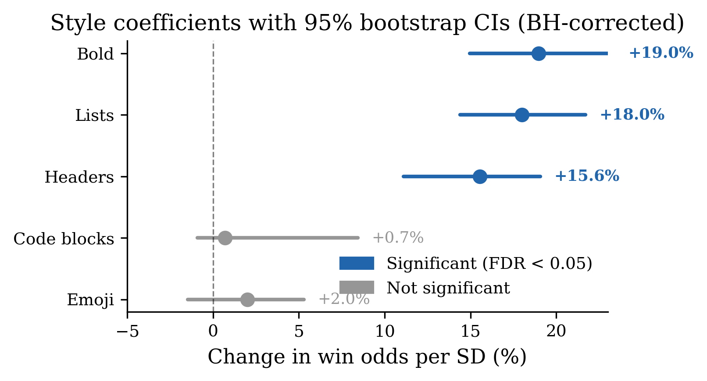
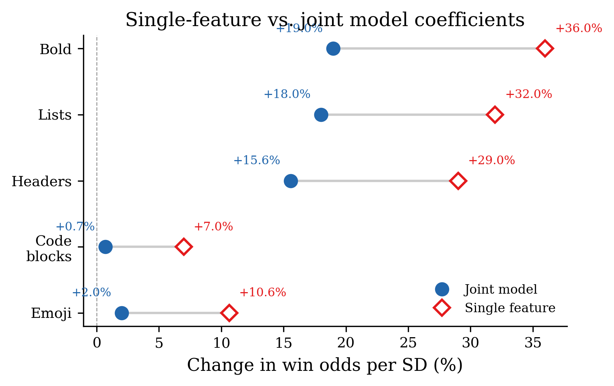
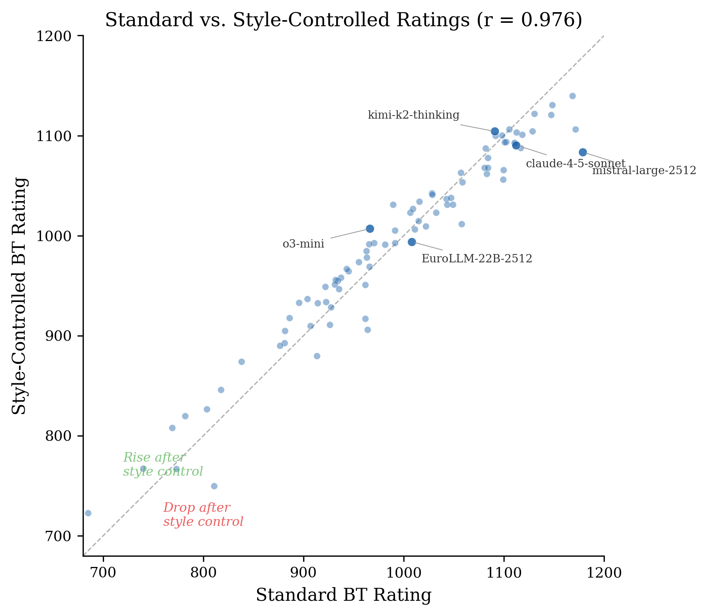
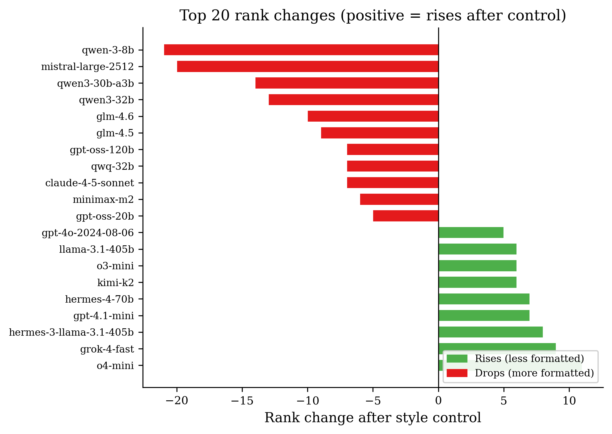
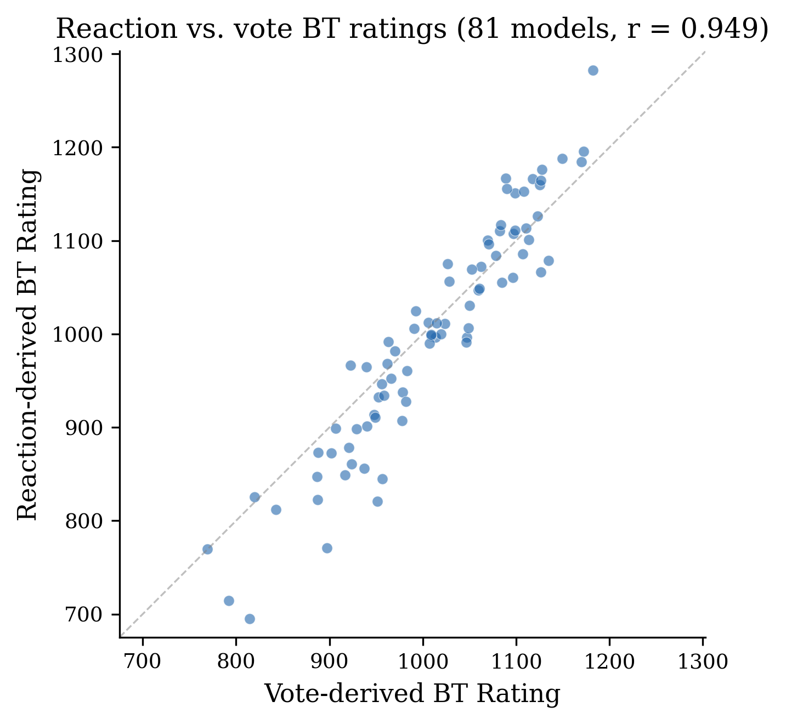
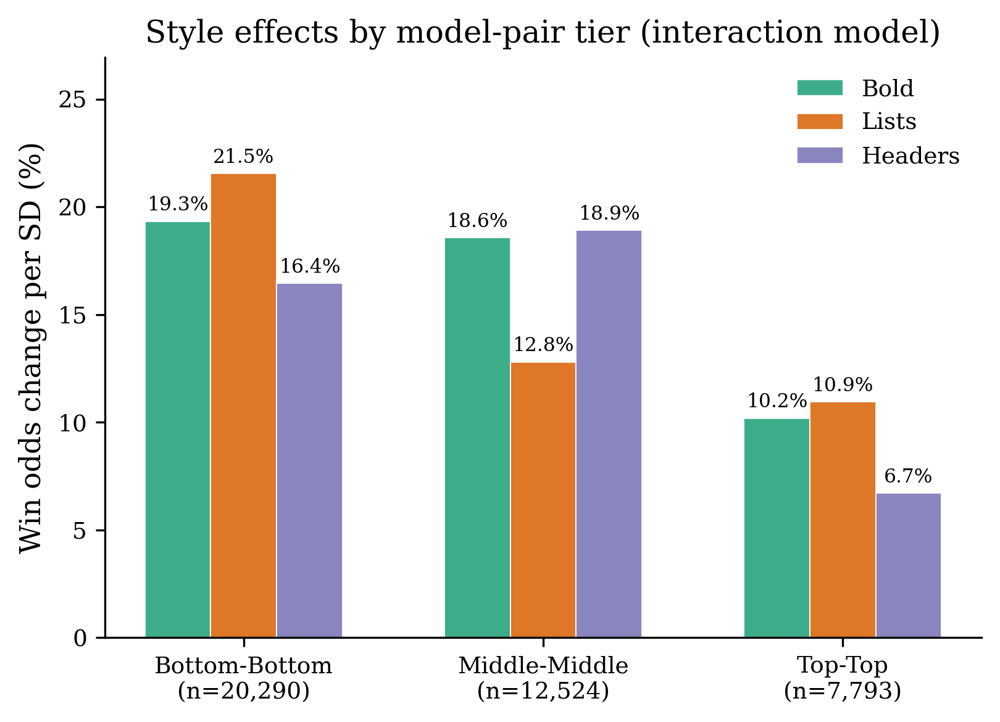
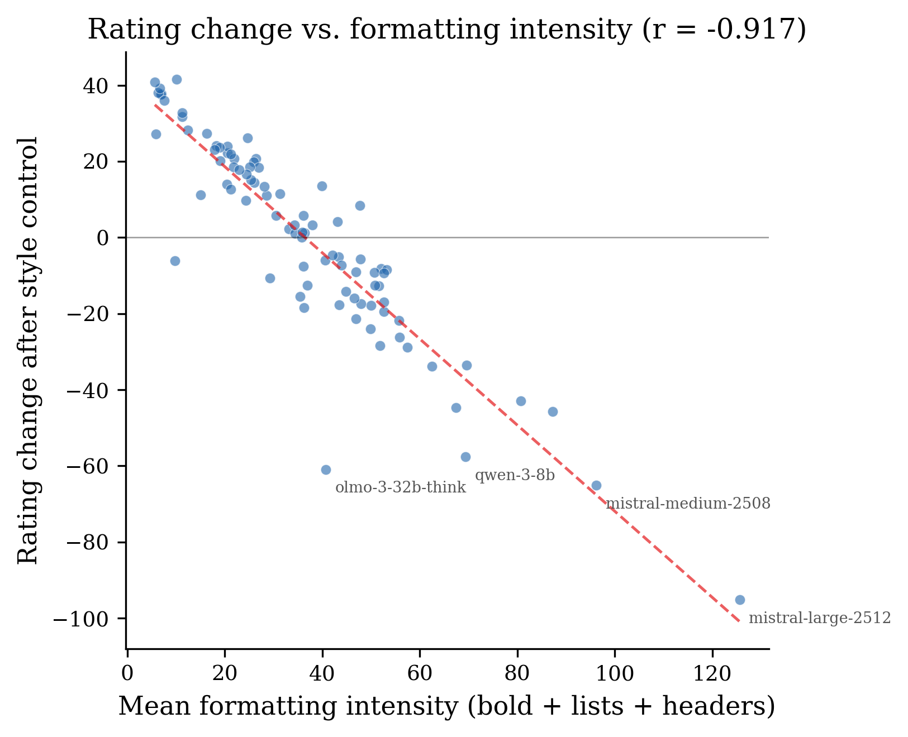
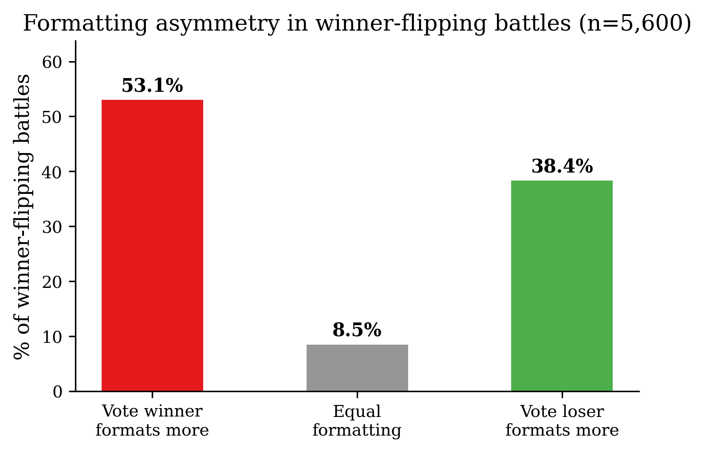

# What Wins a Vote? Formatting, Length, and Lexical Diversity in the French Compar:IA LLM Arena

---

## Abstract

LLM evaluation arenas, where users compare two model outputs side-by-side, have become a primary source of model rankings, and a standing worry is that these rankings reward *presentation* over substance. We study this on Compar:IA, a French government-backed arena, decomposing preference into model skill and presentation with a style-controlled Bradley-Terry model, and going beyond markdown formatting to a full presentation account: **formatting** (bold, lists, headers, code, emoji), **length**, and **linguistic** properties of the text (readability, lexical diversity, sentence structure, and CamemBERT pseudo-perplexity). Three findings emerge. First, presentation genuinely moves votes, but most of it is a single collinear "verbosity" dimension: length, bold, and lists rise and fall together, so their individual attributions are not stable. Second, only two presentation signals survive the full joint control *and* reproduce when the same votes are independently re-cleaned and reformatted (the comparia-fr-arena export): **bold formatting** (about +13% win odds per standard deviation) and **length-independent lexical diversity** (MATTR, +15–19%); readability metrics are collinear and sign-unstable, and perplexity adds essentially nothing. Third, much of the *apparent* linguistic effect is model skill in disguise: coefficients roughly halve when per-model strengths are included, the difference between a confounder and a mediator. Fourth, the feature families act on the vote differently depending on how carefully the answer is read: proxying reading depth by conversation length, the formatting premium is largest in quick single-turn votes and falls by roughly three-quarters (for bold) once a conversation runs several turns, whereas length turns from null to positive and length-independent diversity is unchanged, giving the three families a natural reading-level interpretation. Controlling for the full presentation bundle reshuffles the leaderboard more than formatting alone (rating correlation 0.92; 21 of 83 models move by ≥10 ranks; heavy formatters such as mistral-large-2512 fall ~28 places while concise strong models rise). To our knowledge this is the first style-control analysis of a non-English arena; the formatting effect matches English-language findings, and the core results are robust to an alternative cleaning and feature-extraction pipeline over the same votes (comparia-fr-arena, ~126K battles). The practical message for arena operators is that "quality" rankings partly measure verbosity, and that reporting both raw and presentation-controlled leaderboards is the honest option.

---

## 1. Introduction

The rise of LLM evaluation arenas, platforms where users interact with two anonymous models and select a preferred response, has established a new paradigm for model comparison. The LMSYS Chatbot Arena pioneered this approach, and its Elo-based rankings are widely cited as measures of model quality. The methodology has since been adopted by multiple platforms, including Compar:IA, a French government-backed arena launched in October 2024.

A key concern with arena-based evaluation is the extent to which user preferences reflect genuine content quality versus superficial presentation. Zheng et al. (2023) first noted that LLM judges exhibit a preference for longer, more verbosely formatted outputs, and subsequent work quantified a systematic length and verbosity bias in both human and automatic preference judgments (Singhal et al., 2023; Saito et al., 2023; Dubois et al., 2024). The LMSYS team subsequently introduced "style control" (Li et al., 2024), a methodology that decomposes win probability into model skill and formatting effects using a modified Bradley-Terry model (Bradley & Terry, 1952). Their analysis of English-language data found that controlling for response length, markdown formatting, and list usage modestly reshuffled rankings.

Most style-control work stops at markdown and length. But "presentation" is broader: how readable the prose is, how varied its vocabulary, how long its sentences, all things a user can respond to without them tracking correctness. These linguistic features are correlated with formatting and length, so studying any one in isolation risks mis-attributing a shared effect. We therefore analyze all three families together, **formatting** (bold, lists, headers, code, emoji), **length**, and **linguistic** properties (readability, lexical diversity, sentence structure, perplexity), in a single style-controlled model, and ask which presentation features carry an *independent* effect once the others, and model identity, are held fixed.

It helps to organise these features by the level of reading they act on. Text-comprehension research distinguishes a surface reading of the words (Rayner, 1998) from deeper processing of the text's structure and meaning (Kintsch & van Dijk, 1978; van Dijk & Kintsch, 1983; Just & Carpenter, 1980). Adapting that idea to an arena vote, an evaluation can engage at three levels: (a) a glance at the *shape* of the answer, whether it looks complete and well organised; (b) a reading of its *argument*, whether the content is relevant and thorough; and (c) the *words themselves*, at the surface and semantic level. Our feature families map onto these levels: **formatting** is what a level-(a) glance registers, **length** is the crudest proxy for the level-(b) depth of the answer, and **lexical diversity and readability** are level-(c) properties of the language. This framing, which we owe to the project's supervision, does more than organise the features: it predicts that they should not all matter equally to every vote. A reader who only glances should be swayed most by formatting; a reader who engages with the argument and the words should weight substance more. We return to this prediction in §4.9, where reading depth is proxied by how many turns a conversation ran before the vote.

We apply this analysis to the Compar:IA dataset, which provides a strong setting:

1. **Scale:** ~145,000 cleaned battles across 89 models, spanning 16 months of organic user interactions, with a re-cleaned and reformatted export of the same votes (comparia-fr-arena, ~126,000 French battles) for a processing-pipeline robustness check.
2. **Language:** French-language evaluation, enabling the first cross-linguistic test of whether presentation preferences are culturally invariant.
3. **Multi-signal design:** Both explicit votes (141K) and per-message reactions (27K) provide independent signals that we can cross-validate.
4. **Arena mode metadata:** The platform tracks whether model pairs were randomly assigned, user-selected, or drawn from specialized pools (reasoning, small models, big-vs-small).
5. **Reasoning models:** The dataset includes reasoning models (o3-mini, deepseek-r1, qwq-32b) whose chain-of-thought outputs produce systematically different presentation profiles.

Our central question: **which presentation features independently change which models rank highest, and which apparent effects are really model skill?** Our contributions are: (i) a joint presentation-controlled ranking that separates formatting, length, and linguistic effects from each other and from model skill; (ii) the finding that presentation is largely one collinear verbosity dimension, with only bold formatting and length-independent lexical diversity surviving as robust, replicable signals; (iii) a confounder-versus-mediator analysis showing much apparent linguistic effect is model skill; (iv) a reading-depth test showing that the formatting premium is concentrated in quick, single-turn votes and fades once readers engage over several turns, while length does the opposite and lexical diversity is invariant, which gives the three feature families a reading-level interpretation; and (v) a check that the core findings are robust to an alternative cleaning and feature-extraction pipeline over the same votes.

---

## 2. Data

### 2.1 The Compar:IA Platform

Compar:IA is an LLM evaluation arena operated by the French government's Direction interministérielle du numérique (DINUM). Users submit prompts and receive responses from two anonymous models side-by-side, then vote for a winner or declare a tie. The platform also supports per-message reactions (like/dislike) with optional quality attribute annotations. Models are identified only after voting.

The platform offers five arena modes: **random** (56%), **custom** (27%, user-selected model pairs), **big-vs-small** (5%, deliberately pairing large and small models), **reasoning** (3%, ensuring at least one reasoning model), and **small-models** (2%).

### 2.2 Datasets

The primary analysis (§4.1–§4.7, §4.9–§4.10, §5) uses three datasets published on HuggingFace by the Ministère de la Culture (`ministere-culture/comparia-*`; Ministère de la Culture, 2024). A fourth export, `comparia-fr-arena`, is the same votes re-cleaned and reformatted by the platform, used only as a processing-pipeline robustness check in §4.8.

| Dataset | Raw Rows | After Cleaning | Role | Content |
|---------|----------|---------------|------|---------|
| Conversations | 459,849 | n/a | primary | Conversation pairs with full response text and metadata; source of the style and linguistic features |
| Votes | 148,957 | 141,054 | primary | Explicit winner selections per conversation pair |
| Reactions | 89,717 | 88,939 | primary | Per-message like/dislike with quality attributes |
| comparia-fr-arena | ~138,000 | 126,245 | pipeline check (§4.8) | The same votes, re-cleaned and reformatted by the platform; features recomputed by us, no perplexity |

The three primary datasets carry the linguistic-feature merge and CamemBERT perplexity, so every analysis except §4.8 runs on them. `comparia-fr-arena` is not a separately collected dataset: it is the same underlying compar:IA votes, re-cleaned and reformatted by the platform (with regenerated identifiers, so the two cannot be joined row for row, and a partly different model roster after its own filtering). §4.8 therefore tests whether the findings survive a different cleaning and feature-extraction pipeline, not whether they replicate on independent data.

### 2.3 Data Quality and Cleaning

We applied the following filters, documented in a comprehensive data quality audit:

**Votes:** Removed 508 same-model pairs (0.34%), 3,994 no-choice votes (user revealed models without voting), and 3,401 duplicate conversation_pair_ids (keeping most recent).

**Reactions:** Removed 362 same-model pairs, 995 reactions on even-indexed messages (user messages rather than model responses), and 431 reactions on empty/very short responses (<10 characters).

**Reaction-to-vote conversion:** Reactions were converted to pairwise preferences: for each conversation with reactions on both models, we computed a net score (likes minus dislikes) per model and assigned the winner by higher net score, with ties when scores were equal. This produced 26,669 reaction-derived battles from 50,849 unique conversations; the remaining 45.4% of conversations had reactions on only one model and were excluded (requiring an inner merge).

**Combined dataset (before reasoning filter):** 167,715 battles (141,054 from explicit votes + 26,661 from reactions). Only 8 conversation_pair_ids appeared in both sources; these were deduplicated in favor of explicit votes.

**Reasoning-only content filter.** We identified 25,778 battles (15.1%) where at least one model's response had empty user-visible `content` but non-empty `reasoning` or `reasoning_content` fields, indicating that the chain-of-thought was recorded but the final response text was lost. These battles cannot be meaningfully analyzed for formatting bias since all style features are necessarily zero due to missing text, not because the model produced unformatted output. Removing these battles yielded 145,338 battles, of which **145,096 involve 89 models** with ≥100 battles each. The most affected models were gemini-3-pro-preview (2,635 battles removed), gpt-5-mini (2,383), qwen3-30b-a3b (2,320), and qwen-3-8b (2,311).

### 2.4 Notable Data Quality Findings

**Reasoning content separation.** The dataset stores chain-of-thought reasoning in dedicated `reasoning` and `reasoning_content` fields for 27 reasoning-capable models. However, for a substantial fraction of these models' battles, the user-visible `content` field is empty while reasoning fields are populated, indicating a data pipeline issue where only the chain-of-thought was persisted. These 25,778 affected battles were excluded (see reasoning-only content filter above). Among the remaining battles, only 117 messages (0.08%) across 98 conversations had `<think>` tags leaked into the user-visible content field, primarily from `qwen2.5-coder-32b-instruct` (82) and `deepseek-r1-distill-llama-70b` (33). These were filtered during style feature extraction.

**Security probes.** 56 entries in the arena mode column contained SQL injection, XSS, and SSRF payloads, artifacts of penetration testing against the platform. These were mapped to the "unknown" mode category.

**Reaction-derived tie inflation.** The structural properties of binary reactions produce a 46.8% tie rate in reaction-derived battles versus 30.7% in explicit votes. When a user likes both models or dislikes both, the conversion always yields a tie. Reaction-derived battles therefore provide less discriminating information per battle.

**Near-zero overlap.** Only 8 conversation_pair_ids appear in both the votes and reactions datasets. The two signal sources come from almost entirely different conversations, making cross-validation meaningful.

---

## 3. Methodology

### 3.1 Presentation Features

We measure presentation in three families, all computed per response.

**Formatting**, five markdown features:

| Feature | Description | Regex Pattern |
|---------|-------------|---------------|
| **Headers** | Markdown headers (# through ######) | `^#{1,6}\s` (multiline) |
| **Lists** | Ordered and unordered list items | `^\s*[-*+]\s` and `^\s*\d+\.\s` |
| **Bold** | Bold-formatted text | `\*\*[^*]+\*\*` |
| **Code blocks** | Fenced code blocks | ` ``` ` or `~~~` (counted in pairs) |
| **Emoji** | Emoji characters | Unicode emoji ranges |

**Length**, the response's output-token count from the dataset metadata (not a whitespace word count, which is unreliable for French).

**Linguistic**, text properties beyond formatting: readability (Kandel-Moles REL, calibrated for French; Coleman-Liau; Flesch-Kincaid grade), lexical diversity (type-token ratio TTR and its length-robust moving-average variant MATTR, over a 50-token window), sentence structure (mean sentence length and the fraction of long sentences), and CamemBERT pseudo-perplexity as a fluency proxy.

Our primary formatting analysis (§4.1–§4.6) uses the five markdown features only, so it is directly comparable to prior English-language style control. We hold length and the linguistic family back to §4.7 for a specific reason: **length confounds with completeness**, a genuine quality dimension. Users may prefer more thorough answers, and the `complete` quality attribute in reaction data correlates with higher like rates (28.9% of liked messages were tagged "complete" versus 0% of disliked), so controlling for length risks removing legitimate quality signal rather than bias. §4.7 confronts that trade-off head-on by adding length and all linguistic features to the same model, and §4.8 checks the result against an alternative cleaning and feature-extraction pipeline over the same votes. The linguistic features are computed with the exact formulas of a companion internship analysis, so a feature means the same thing across the two pipelines.

### 3.2 Bradley-Terry Model

We rank models using a Bradley-Terry model estimated via logistic regression, following the methodology of the LMSYS Chatbot Arena.

**Standard model.** For each decisive battle (A wins or B wins), we construct a feature vector with +1 for the winning model's index and -1 for the losing model's index, then fit a logistic regression without regularization. Ratings are computed as:

$$\text{Rating}_i = 1000 + \frac{400 \cdot \beta_i}{\ln(10)}$$

**Style-controlled model.** We augment the model indicator features with style difference features. For each formatting feature $f$, we compute $\Delta f = f_A - f_B$ (standardized to zero mean and unit variance), then fit:

$$P(\text{A wins}) = \sigma\left(\sum_i \beta_i \cdot \mathbb{1}_i + \sum_f \gamma_f \cdot \Delta f\right)$$

where $\beta_i$ are model skill parameters and $\gamma_f$ are style coefficients. The style-controlled rating uses only the $\beta_i$ coefficients, with formatting effects absorbed by $\gamma_f$.

### 3.3 Bootstrap Inference

We computed 95% confidence intervals via nonparametric bootstrap (Efron, 1979), with 1,000 iterations for both style coefficients and BT ratings. Each bootstrap sample drew battles with replacement from the full dataset and re-estimated the model.

For each test, we derived two-sided bootstrap p-values as $p = 2 \cdot \min(\hat{F}(0), 1 - \hat{F}(0))$, where $\hat{F}(0)$ is the proportion of bootstrap replicates with the statistic $\leq 0$, with a floor of $1/(B+1)$ to avoid zero p-values.

### 3.4 Multiple Comparison Correction

We applied the Benjamini-Hochberg (BH) procedure (Benjamini & Hochberg, 1995) to control the false discovery rate (FDR) at 0.05. Corrections were applied separately to two families of tests: the 5 style coefficient tests and the 89 model rank change tests. The BH procedure ranks p-values and adjusts each as $p_{\text{BH}}^{(i)} = p^{(i)} \cdot m / i$, enforcing monotonicity via step-up.

---

## 4. Results

### 4.1 Style Coefficients

Table 1 shows the estimated effect of each formatting feature on win probability, after controlling for model identity. Figure 1 presents these coefficients as a forest plot with bootstrap confidence intervals.



**Table 1. Style coefficients from the Bradley-Terry model (145,096 battles, 89 models). p-values are BH-adjusted across 5 tests.**

| Feature | Coefficient | 95% CI | % Odds Change | 95% CI | p (BH) | Significant? |
|---------|------------|--------|---------------|--------|--------|-------------|
| **Bold** | +0.174 | [+0.140, +0.210] | **+19.0%** | [+15.0%, +23.4%] | 0.003 | Yes |
| **Lists** | +0.165 | [+0.134, +0.196] | **+18.0%** | [+14.4%, +21.7%] | 0.003 | Yes |
| **Headers** | +0.145 | [+0.105, +0.175] | **+15.6%** | [+11.1%, +19.1%] | 0.003 | Yes |
| Code blocks | +0.007 | [-0.009, +0.081] | +0.7% | [-0.9%, +8.4%] | 0.550 | No |
| Emoji | +0.020 | [-0.015, +0.052] | +2.0% | [-1.5%, +5.3%] | 0.360 | No |

**Interpretation.** A one-standard-deviation increase in bold formatting gives a response a 19.0% boost in win odds, independent of which model produced it. Lists and headers have comparable effects (+18.0% and +15.6%). Code blocks and emoji have negligible effects that are not statistically distinguishable from zero. These effects are somewhat larger than before the reasoning-only content filter, consistent with the filter having removed battles where zero-valued style features diluted the estimated formatting effect.

The three significant features, bold, lists, and headers, all relate to structural formatting that makes responses visually organized. The null effect for code blocks suggests that code formatting per se does not influence preferences (its effect may depend on the task being coding-related). The null effect for emoji runs counter to the popular assumption that emoji-laden responses are preferred.

### 4.2 Ablation Study

To understand which features contribute most to rank changes, we ran the BT model controlling for one feature at a time.

**Table 2. Ablation: single-feature style control**

| Feature Controlled | Coefficient (alone) | Rank Correlation with Standard |
|-------------------|--------------------|-----------------------------|
| Bold only | +0.307 (+36.0%) | 0.982 |
| Lists only | +0.277 (+32.0%) | 0.992 |
| Headers only | +0.255 (+29.0%) | 0.993 |
| Code blocks only | +0.068 (+7.0%) | 0.999 |
| Emoji only | +0.101 (+10.6%) | 0.997 |
| **All five** | **(see Table 1)** | **0.976** |

When features are controlled individually, their coefficients are roughly double those in the joint model (e.g., bold alone: +36.0% vs. bold joint: +19.0%), as shown in Figure 5. This reflects the correlation among formatting features, models that use more bold also tend to use more lists and headers. The joint model partitions the shared variance among correlated features.



Bold alone produces the most rank disruption (r=0.982), consistent with it having the largest joint coefficient.

### 4.3 Ranking Impact

The overall correlation between standard and style-controlled BT ratings is **r = 0.976** (Figure 2). Rankings are highly stable overall, but specific models shift substantially. Note that mistral-medium-3.1, originally tracked as a separate model, was merged into mistral-medium-2508 based on model registry information, yielding 89 rather than 90 distinct models. (This reshuffle controls for markdown formatting only; §4.7 shows that additionally controlling for length and linguistic features moves the leaderboard further, since length carries part of the presentation effect.)

**Table 3. Top 10 models: standard vs. style-controlled rankings.**

| Rank | Standard Ranking | Rating | | Rank | Style-Controlled Ranking | Rating |
|:----:|:-----------------|-------:|-|:----:|:-------------------------|-------:|
| 1 | gemini-3-pro-preview | 1279.2 | | 1 | gemini-3-pro-preview | 1283.3 |
| 2 | gemini-3-flash-preview | 1204.8 | | 2 | gemini-3-flash-preview | 1197.2 |
| 3 | **mistral-large-2512** | 1178.6 | | 3 | gemini-2.5-flash *(std #5)* | 1139.9 |
| 4 | mistral-medium-2508 | 1171.3 | | 4 | magistral-medium *(std #6)* | 1130.6 |
| 5 | gemini-2.5-flash | 1168.3 | | 5 | gemini-2.0-flash *(std #8)* | 1121.8 |
| 6 | magistral-medium | 1148.0 | | 6 | qwen3-max-2025-09-23 *(std #7)* | 1120.9 |
| 7 | qwen3-max-2025-09-23 | 1147.0 | | 7 | grok-4.1-fast *(std #17)* | 1106.4 |
| 8 | gemini-2.0-flash | 1130.2 | | 8 | mistral-medium-2508 *(std #4)* | 1106.2 |
| 9 | gpt-5.1 | 1128.4 | | 9 | gpt-5.1 *(std #9)* | 1104.3 |
| 10 | deepseek-v3-0324 | 1118.1 | | 10 | kimi-k2-thinking *(std #24)* | 1104.2 |

**mistral-large-2512** (bolded), which dominates standard rankings at #3, drops out of the style-controlled top 10 entirely, replaced by models like kimi-k2-thinking and grok-4.1-fast that produce less formatted output. Figure 3 shows the top 20 rank movers.





**Table 4. Top 10 rank changes after style control. p-values are BH-adjusted across all 89 models (FDR < 0.05).**

| Model | Std Rank | Ctrl Rank | ΔRank | ΔRating | p (BH) | Sig? |
|-------|---------|-----------|-------|---------|--------|------|
| qwen-3-8b | 55 | 76 | **-21** | -57.6 | 0.003 | Yes |
| mistral-large-2512 | 3 | 23 | **-20** | -95.2 | 0.003 | Yes |
| qwen3-30b-a3b | 59 | 73 | **-14** | -44.6 | 0.003 | Yes |
| kimi-k2-thinking | 24 | 10 | +14 | +13.5 | 0.578 | No |
| qwen3-32b | 31 | 44 | **-13** | -45.8 | 0.003 | Yes |
| o4-mini | 49 | 38 | **+11** | +41.6 | 0.003 | Yes |
| grok-4.1-fast | 17 | 7 | +10 | +1.3 | 0.536 | No |
| glm-4.6 | 11 | 21 | **-10** | -28.9 | 0.003 | Yes |
| grok-3-mini-beta | 23 | 14 | +9 | +8.5 | 0.405 | No |
| glm-4.5 | 21 | 30 | **-9** | -43.0 | 0.003 | Yes |

**7 of 10 top rank changes remain statistically significant** after BH correction (FDR < 0.05). Across all 89 models, **76 of 89 (85%)** show significant rating changes after style control, indicating that formatting bias affects the vast majority of models, not just a few outliers.

The most dramatic shift is for **mistral-large-2512**, which drops from rank 3 to rank 23 (−95.2 rating points). This model produces heavily formatted outputs (abundant bold, headers, and lists) that are rewarded in standard rankings but absorbed by the style control.

### 4.4 Reasoning Models and Formatting

Reasoning models show a mixed but on-average positive pattern after style control.

**Table 5. Reasoning model rank changes**

| Model | Std Rank → Ctrl Rank | ΔRank | Sig? |
|-------|---------------------|-------|------|
| kimi-k2-thinking | 24 → 10 | +14 | No |
| o4-mini | 49 → 38 | **+11** | Yes |
| grok-3-mini-beta | 23 → 14 | +9 | No |
| o3-mini | 52 → 46 | **+6** | Yes |
| deepseek-r1-distill-llama-70b | 74 → 75 | -1 | No |
| deepseek-r1-0528 | 15 → 17 | **-2** | Yes |
| deepseek-r1 | 37 → 41 | **-4** | Yes |
| olmo-3-32b-think | 83 → 88 | -5 | No |
| qwq-32b | 73 → 80 | **-7** | Yes |

**Mean rank change for reasoning models: +2.3** (modestly rising). Four of nine rise and five fall, a pattern that is directionally positive but less uniform than might be expected.

The two largest risers, kimi-k2-thinking (+14) and grok-3-mini-beta (+9), are not statistically significant after BH correction, likely because the reasoning-only content filter removed many of their battles (1,121 and an unknown number, respectively), reducing statistical power. Among significant movers, o4-mini (+11) and o3-mini (+6) rise, while deepseek-r1 (−4), qwq-32b (−7), and deepseek-r1-0528 (−2) fall.

This mixed pattern has an important methodological implication. Before applying the reasoning-only content filter (Section 2.3), the mean reasoning model rank change was +4.4 with 7 of 9 models rising or holding. The reduction to +2.3 after the filter demonstrates that the earlier finding was partially inflated by battles where reasoning models had zero-valued style features due to missing content rather than genuinely plain-text output. The corrected pattern suggests that while some reasoning models do benefit from style control (plausibly because they prioritize reasoning depth over visual formatting), others produce output that is comparably or even more formatted than non-reasoning models.

### 4.5 Position Bias

We observe a statistically significant but negligible position bias, a form of the ordering bias documented for LLM judges by Wang et al. (2023): model A wins 50.40% of decisive battles versus 49.60% for model B (binomial test p = 0.013). The effect size (0.80 percentage points) is too small to meaningfully affect rankings.

### 4.6 Sensitivity Analyses

**Votes only versus combined.** BT ratings computed from explicit votes alone correlate at r = 0.943 with the combined (votes + reactions) ratings, with a maximum rank difference of 45 positions. The reasoning-only content filter disproportionately removed vote battles (22,521 of 25,778 removed), which reduced the vote-only sample to 118,533 battles and increased the relative weight of reaction-derived battles in the combined rankings. This explains the lower correlation compared to what would be expected with the full vote dataset.

**Reaction versus vote agreement.** Among the 85 models with sufficient battles in both sources, reaction-derived BT ratings correlate at r = 0.867 with vote-derived ratings (Figure 6). This agreement from two independent signal sources, with near-zero conversation overlap, supports the validity of both measures, though the moderate correlation also indicates meaningful disagreement on some models' relative positions.



Note: The votes-only and reaction-vs-vote correlations (r = 0.943 and r = 0.867 respectively) are lower than in preliminary analyses because the reasoning-only content filter disproportionately affected vote battles, altering the relative composition of the combined dataset.

### 4.7 Length and Linguistic Features

The formatting model of §3–§4 deliberately excludes length (§3.1) and considers only markdown. Here we revisit both choices by adding, on the same battle table, the answer's **length** (output-token count from the dataset metadata, not a whitespace word count) and a set of **linguistic** features computed for a companion analysis: readability (Kandel-Moles REL, Coleman-Liau, Flesch-Kincaid), lexical diversity (type-token ratio TTR and its length-robust moving-average variant MATTR), sentence structure (mean sentence length, long-sentence ratio), and CamemBERT pseudo-perplexity. The linguistic features are available for 105,083 battles (73.9%); after requiring every feature and ≥100 battles per model, the common support is **100,545 battles across 83 models**. All coefficients use the same standardized A−B contrast as §3.2, additionally winsorized at 1/99% because several features are heavy-tailed; bootstrap (n=1,000) and Benjamini-Hochberg follow §3.3–§3.4.


**Length is large, and it is partly what "formatting" was measuring.** On its own as a covariate, a one-SD length advantage raises win odds by **+15.7%**, as large as any markdown feature. Adding it shrinks the formatting coefficients: lists +16.1%→+12.1%, bold +16.6%→+10.7%, headers +11.6%→+10.7%. This is unsurprising given how correlated these are (Δlength vs Δbold ρ=+0.65, vs Δlists ρ=+0.58): longer answers carry more markdown. The team's original argument for excluding length, that it proxies completeness, a genuine quality dimension, still stands; the point here is quantitative, that a non-trivial share of the headline formatting effect travels with length.

**Formatting nonetheless survives the full joint model.** With length and all linguistic features held fixed, the markdown effects remain positive and significant after BH correction: bold **+13.0%** [+9.4, +16.3], lists **+10.8%**, headers **+9.3%**, code blocks +5.7%, emoji +4.1%. So formatting bias is not merely length in disguise.

**Length itself becomes uninterpretable once its correlates are present** (+1.4%, n.s. in the joint model): its variance is shared with bold, lists, and inversely with TTR (ρ=−0.51). The honest reading is that length, markdown density, and raw diversity form one collinear "verbosity" bundle whose individual attributions are unstable, even though the bundle jointly predicts votes.

**Among the linguistic features, the one clean, robust signal is lexical diversity measured length-robustly.** MATTR carries **+19.3%** [+16.3, +22.3] and is essentially uncorrelated with length (ρ=+0.02), so it is not a verbosity proxy: at equal length, more varied vocabulary wins. Raw TTR (−29.5%) is the opposite face of the same coin, mechanically a decreasing function of length (ρ=−0.51), and should not be read as an independent diversity effect. The readability metrics are jointly significant but mutually collinear and sign-unstable across specifications (REL +13.3% and FKG +12.4% point in opposite substantive directions), so we do not interpret them individually; this echoes the companion analysis, which retained only a subset of readability scores for the same reason. **Pseudo-perplexity adds essentially nothing** once length and readability are present (−6.5% per SD, winsorized; it is available only on the primary data, since CamemBERT needs a GPU), i.e. a CamemBERT-fluency signal does not explain votes beyond the simpler features.

**Adding these features improves fit**: held-out-free battle-prediction accuracy rises from 0.643 (formatting) to 0.645 (+length) to **0.651** (joint), a modest gain consistent with style being a real but secondary driver of the vote.

**The full presentation control reshuffles the leaderboard more than formatting alone.** On this common support (100,545 battles, 83 models), the standard ranking correlates with the formatting-only style-controlled ranking at r = 0.954, but with the *joint* (formatting + length + linguistic) style-controlled ranking at only **r = 0.916** (Spearman 0.90). Under the joint control, **21 of 83 models move by ≥10 ranks**. The movers are exactly the verbosity story made concrete: heavy formatters fall (mistral-large-2512 −28 ranks, glm-4.5 −29, gpt-oss-120b −24), while concise but strong models rise (claude-3-7-sonnet +26, claude-4-sonnet +24). This is the honest counterpart to §4.3: controlling for presentation, rather than markdown alone, does not overturn the leaderboard but does materially rearrange its middle and upper-middle.

Finally, the confounder-vs-mediator pattern of §5.3 reappears feature by feature: moving from a reduced-form logit (no per-model strengths) to the full Bradley-Terry roughly halves bold (+24.4%→+12.2%) and collapses mean sentence length (+15.3%→−2.2%), confirming that a large part of the apparent linguistic effects is model strength rather than presentation bias.

### 4.8 Robustness to an alternative processing pipeline (comparia-fr-arena)

Sections 4.1–4.7 use the votes+reactions data as we cleaned and featurized it. `comparia-fr-arena` is **the same underlying compar:IA votes, re-cleaned and reformatted by the platform** (consolidated, with regenerated identifiers, and a partly different model roster after its own filtering); it is not a separately collected dataset, so this is not an independent replication. What it does provide is a second, differently built pipeline over the same human judgements: we take its cleaned battles, recompute the identical feature set ourselves (same markdown regexes, output-token length, same readability/diversity/structure features), and fit the same winsorized joint Bradley-Terry model (126,245 French battles, 116 models). Agreement here therefore rules out that a finding is an artefact of *our* specific cleaning, filtering, or feature-extraction choices; it cannot rule out an artefact of the underlying corpus, since there is only one. Perplexity is omitted (GPU-only, and §4.7 already finds it null).

The two most important effects reproduce almost exactly, and the accuracy gain from adding linguistic features reappears (0.637→0.638→0.643, versus 0.643→0.645→0.651 primary):

| Feature | Primary (votes+reactions) | comparia-fr-arena |
|---|---:|---:|
| bold | **+13.0%** *** | **+13.7%** *** |
| headers | +9.3% *** | +7.7% *** |
| emoji | +4.1% *** | +3.6% *** |
| code_blocks | +5.7% *** | +2.4% *** |
| **MATTR** (length-robust diversity) | **+19.3%** *** | **+15.2%** *** |
| TTR (length proxy) | −29.5% *** | −24.0% *** |
| long_sent_ratio | −4.4% *** | −3.2% *** |
| length | +1.4% n.s. | +10.7% *** |
| lists | +10.8% *** | +1.3% n.s. |
| REL / FKG (readability) | +13.3% / +12.4% *** | −3.3% / −6.0% n.s. |

Bold formatting (~+13%) and length-independent lexical diversity (MATTR, +15–19%) reproduce under this alternative pipeline, evidence that they are not artefacts of our particular cleaning or feature code. Because the underlying votes are the same, this does not speak to sampling or corpus-level artefacts, but it does close off the most common "you preprocessed it into existence" objection. The divergences are more telling still. Within the collinear verbosity bundle (length, bold, lists, TTR), individual attributions move even across two cleanings of the *same* data: length is fully absorbed in our primary pipeline but carries +10.7% here, and lists is the reverse. And the readability metrics flip sign (REL +13.3%→−3.3%). That these coefficients are unstable across preprocessing alone, not merely across samples, is a sharper warning than §4.7 gave on its own, and it reinforces our decision not to read them individually. In short: the two signals we highlight survive a change of pipeline, and the features we already declined to over-read are confirmed pipeline-sensitive.

### 4.9 Reading Depth: Does Presentation Matter Less When the Answer Is Read More Carefully?

The three-level framing of §1 makes a testable prediction. If formatting wins mainly through a level-(a) glance at the shape of the answer, its pull should fade once a reader engages more deeply; conversely, level-(b) depth (length) and level-(c) language properties should hold up or matter more. We test this by proxying reading depth with **conversation length**: a single-turn battle (the user asked once, then voted) invites a quick surface judgement, whereas a multi-turn battle (≥2 user turns before the vote) signals commitment and a more attentive read. Turn counts come from the votes export (`conv_turns`, which equals the count of user messages in 99.1% of conversations); they are cleanly defined only for vote-derived battles, so this analysis is vote-only. Across all vote conversations 81.3% are single-turn and 18.7% multi-turn (80.5% and 19.5% within this analysis's common support).

Rather than compare two separately estimated subsets, we fit a single pooled Bradley-Terry model with per-model strengths, the standardized A−B style contrasts, and each contrast **interacted with a multi-turn indicator**. The interaction coefficient is the quantity of interest: negative means the feature moves a vote less when the conversation ran long. Contrasts are standardized once on the full vote sample, so the single-turn effect and the interaction share a scale; bootstrap (n=1,000) and BH follow §3.3–§3.4. Because multi-turn answers accumulate more text, and hence a wider spread of raw formatting contrasts, any mechanical artefact would *inflate* the per-SD multi-turn coefficient, so the shrinkage we report is if anything conservative.

**Formatting effects shrink sharply with reading depth.** In the formatting-only model (77,893 battles, 82 models), every markdown effect is smaller in multi-turn battles, and four of five interactions are significant after BH correction:

**Table 7. Formatting effect by reading depth (odds change per SD; interaction is the multi-turn slope shift).**

| Feature | Single-turn | Multi-turn | Interaction (log-odds) | p (BH) |
|---------|:-----------:|:----------:|:----------------------:|:------:|
| **Bold** | **+42.2%** | **+9.4%** | −0.205 [−0.248, −0.163] | 0.003 |
| Lists | +24.1% | +7.9% | −0.085 [−0.127, −0.049] | 0.003 |
| Headers | +19.4% | +5.9% | −0.074 [−0.110, −0.041] | 0.003 |
| Code blocks | +12.1% | +1.1% | −0.051 [−0.085, −0.016] | 0.005 |
| Emoji | +6.9% | +2.2% | −0.005 [−0.040, +0.031] | 0.816 |

Bold, the strongest surface cue, is also the one that fades most: its advantage falls from +42% win odds per SD in single-turn battles to +9% in multi-turn ones, roughly a 78% reduction. Only emoji, which carries no real effect to begin with, is unchanged. This is direct evidence for the glance interpretation of formatting: the visual-shape advantage is largest exactly when the reader is least engaged.


**Length and diversity go the other way, as the framing predicts.** Adding length and the linguistic features (joint model, 68,462 battles, 80 models) leaves the formatting pattern intact (bold interaction −0.190, headers −0.067, code −0.045, all significant) and reveals the complementary movements:

- **Length matters more, not less, when reading is attentive.** Its coefficient moves from −3.6% (single-turn, effectively null once formatting is held fixed) to +3.3% (multi-turn); the interaction is +0.131 [+0.076, +0.182], significant. A longer answer does nothing for a glancing reader but helps once the reader engages with its content, precisely the level-(b) prediction that depth is read as substance only when it is actually read. The raw-TTR interaction (+0.165, significant) is the same fact seen through TTR's role as an inverse length proxy.
- **Length-independent lexical diversity is stable across reading depth.** MATTR carries +18.9% in single-turn and +18.6% in multi-turn battles; its interaction (−0.036) is not significant. The one clean level-(c) signal does not depend on how carefully the answer is read: richer vocabulary wins on a glance and on a close read alike. This is a useful robustness result for the paper's headline MATTR finding, and it distinguishes MATTR sharply from formatting.

Readability interactions are mixed and mostly not significant (only Coleman-Liau reaches significance), consistent with §4.7's decision not to interpret those coefficients individually.

**Caveats.** Reading depth is proxied, not measured: multi-turn conversations may also differ in task type, difficulty, or user disposition (a user who continues may be harder to satisfy), and which conversations become multi-turn is not random. We hold model strengths common across depth, assuming a model's ability is the same in short and long conversations while only its style sensitivity varies. §4.10 shows the shrinkage is not merely a topic-composition effect. With those caveats, the pattern is coherent and hard to get by chance: the surface-formatting channel weakens with engagement, the depth channel strengthens, and the vocabulary channel is invariant, exactly the ordering the three-level reading account predicts.

### 4.10 Topic Controls: Is the Formatting Premium Just a Proxy for Subject Matter?

A natural objection is that presentation features stand in for topic: technical questions invite code blocks and lists, some subjects invite longer, more marked-up answers, so a formatting effect could really be a topic effect. We use the conversations export's `categories` field, an LLM-assigned taxonomy of about 18 subject classes present for 94% of battles (we take the first of a conversation's up-to-two categories as its primary topic). Because topic is a property of the shared prompt, it differences out of the pairwise A−B model, so a topic *main* effect is not estimable; topic can only enter through **topic × style interactions**, i.e. by letting each subject have its own formatting slope. We ask two things of it.

**The formatting premium holds within every topic.** Refitting the headline formatting Bradley-Terry model separately inside each topic with at least 2,500 battles (10 topics), bold, lists, and headers are positive in **every** topic; bold's 95% bootstrap CI excludes zero in 8 of the 10 topics (and is positive in all 10), lists in 9 of 10 (Arts is the exception), headers in 8 of 10. The pooled fit excludes zero for all three.

**Table 8. Formatting effect (odds change per SD) within each topic. Code blocks and emoji omitted (near-null and, for emoji, unstable in sparse strata).**

| Topic | Battles | Bold | Lists | Headers |
|-------|:------:|:----:|:-----:|:-------:|
| *All topics (pooled)* | 88,582 | +20.2% | +17.8% | +12.2% |
| Education | 19,231 | +15.9% | +8.3% | +6.5% |
| Natural Science & Technology | 16,963 | +16.5% | +21.8% | +12.0% |
| Business & Economics & Finance | 8,873 | +15.6% | +12.9% | +19.4% |
| Entertainment & Travel & Hobby | 7,449 | +15.1% | +44.7% | +1.4% |
| Politics & Government | 5,306 | +69.8% | +24.4% | +4.8% |
| Food & Drink & Cooking | 3,734 | +15.3% | +33.9% | +29.9% |
| Health & Wellness & Medicine | 2,975 | +26.2% | +51.7% | +15.2% |
| Environment | 2,045 | +22.7% | +29.5% | +27.5% |
| Arts | 2,106 | +44.5% | +6.8% | +19.9% |
| Law & Justice | 1,919 | +30.0% | +25.5% | +22.7% |


The premium is therefore not an artefact of a few formatting-heavy subjects: it is present everywhere. The *magnitude* does vary across topics, and some of that is real (bold looks unusually strong in Politics and Arts), but the small strata also carry wide intervals, so we do not over-read the topic-by-topic ordering. Code blocks are near-null in every topic (consistent with the pooled result), and emoji produces implausibly large swings in a few sparse strata (for example Law & Justice), a sparse-feature artefact rather than a real subject effect. This heterogeneity is exactly why topic enters as an interaction rather than a control we can difference away.

**The reading-depth result survives topic controls.** We re-fit the §4.9 formatting × multi-turn interaction model with the topic × formatting interactions added, so every subject gets its own formatting slope before we ask about reading depth (77,447 battles, 81 models, 13 topic dummies). The multi-turn interactions are essentially unchanged from §4.9: bold −0.212, lists −0.084, headers −0.071, code blocks −0.041 (all significant after BH), emoji −0.005 (n.s.). The formatting-fades-with-engagement pattern is thus not multi-turn battles being a different topic mix; it holds within topic.

Topic here is subject matter, not task type (summarise, translate, write code, give advice); a task-type control would be a useful further step but is not cleanly available in the metadata, so we leave it to future work.

---

## 5. Discussion

### 5.1 Presentation Bias Is Real, but It Is Mostly One Dimension

Three things hold together across our analyses. First, presentation genuinely influences French arena votes: in the formatting-only model, bold, lists, and headers each raise win odds by 16–19% per standard deviation, and the effect matches English-language style control, so this is not a culture-specific quirk. Second, once length and linguistic features enter the model, most of that effect turns out to be a **single collinear "verbosity" dimension**: length, bold, and lists are correlated (Δlength–Δbold ρ = 0.65), they trade coefficient weight among themselves, and their individual attributions are not stable across processing pipelines (§4.8). The honest summary is not "bold is worth exactly +13%" but "answers that are longer and more heavily marked up win, and we cannot cleanly divide the credit."

Third, and more usefully, two signals stand apart from that bundle and survive every control we apply, in both our primary pipeline and the re-cleaned comparia-fr-arena one: **bold formatting** and **length-independent lexical diversity** (MATTR). MATTR is the more interesting of the two. It is essentially uncorrelated with length (ρ = 0.02), so it is not verbosity in disguise: holding length fixed, answers that use a more varied vocabulary win. This is a genuinely new result relative to formatting-only style control, and it points at a preference for richer language rather than merely more of it. By contrast, readability scores are collinear and sign-unstable across pipelines, and CamemBERT perplexity adds nothing once length and readability are present, so "fluency" as a fluency model measures it does not explain votes.

The aggregate impact on rankings is moderate but real, and larger under full presentation control than under formatting alone (r = 0.92 vs 0.95; §4.7). Presentation reshuffles the middle of the leaderboard (heavy formatters fall ~25–30 places, concise strong models rise) without overturning the very top, which is still governed by genuine quality gaps.

Finally, the reading-depth test (§4.9) gives the collinear bundle a mechanism rather than just a name. The features do not act on the vote in the same way, and they separate exactly along the three levels of reading we set out in §1. Formatting behaves like a *glance* cue: its effect is large when the reader engages least (single-turn) and shrinks by roughly three-quarters, for bold, once the conversation runs several turns. Length behaves like a *depth* cue: it does nothing for a glancing reader but turns positive once the reader engages with the content. Length-independent lexical diversity (MATTR) behaves like a *language* property: it wins whether the answer is skimmed or read closely. This is why "verbosity" is the right level of description for the bundle but the wrong level for the mechanism: what looks like one collinear dimension in the pooled model is, under the reading-depth lens, a fast surface channel and a slower substance channel that happen to be correlated in the data. It also sharpens the practical worry: the formatting premium is concentrated in precisely the low-engagement votes where it is least likely to reflect a considered judgement of quality.

### 5.2 Implications for Arena Design

The systematic benefit to formatting-heavy models has practical implications for arena operators:

1. **Ranking interpretation.** Models like mistral-large-2512 (rank 3 → 23 after style control) and mistral-medium-2508 (rank 4 → 8) may be overranked due to formatting rather than content quality. Arena leaderboards should consider publishing both standard and style-controlled rankings.

2. **Reasoning model evaluation.** The current arena format may systematically undervalue reasoning models, which sacrifice formatting for reasoning depth. Specialized evaluation tracks or formatting-agnostic presentation (e.g., rendering all responses in plain text) could address this.

3. **Model development incentives.** If arena rankings drive model development priorities, formatting bias creates perverse incentives: teams may optimize for visually appealing output rather than substantive quality.

### 5.3 Endogeneity: Confounder or Mediator?

A fundamental interpretive challenge for observational style control is endogeneity. Our style features are covariates, not experimental manipulations, and two competing causal models fit the data:

**Confounder hypothesis (formatting as bias).** Users are partially "fooled" by visual presentation. Formatting creates a halo effect that inflates win probability independent of content quality. Under this model, style control removes a bias, and style-controlled rankings better reflect true model quality.

**Mediator hypothesis (formatting as quality signal).** Better models produce better-structured output *because they are more capable*, they understand when to use headers, lists, and bold emphasis to organize complex information. Formatting mediates the relationship between model capability and user preference. Under this model, style control inadvertently removes legitimate quality signal.

We present three empirical tests that shed light on this question, though they cannot fully resolve it.

**Test 1: Quality–formatting correlation.** We computed each model's average formatting intensity (composite of bold, lists, and headers per response) and correlated it with standard BT ratings across all 89 models. The correlation is strong and positive: Pearson r = 0.66 (p < 10⁻¹¹), Spearman ρ = 0.74 (p < 10⁻¹⁶). Higher-rated models produce substantially more formatted output. This is consistent with the mediator hypothesis, better models do format more, but it is also consistent with the confounder hypothesis if formatting inflates ratings.

After style control, the correlation between model ratings and formatting intensity drops from r = 0.66 to r = 0.50. Style control weakens but does not eliminate the quality–formatting association, suggesting that the relationship is partially genuine (mediation) and partially artifactual (confounding).

**Test 2: Tier-stratified style effects.** If formatting is purely a mediator of quality, its effect on win probability should be similar regardless of model tier, good formatting should help a top model as much as a bottom model. If formatting is a confounder (bias), its effect might differ by tier, potentially helping weaker models more. We split the 89 models into three tiers of approximately equal size (top, middle, bottom) by standard BT rating and ran the style-controlled BT model separately on within-tier battles.

**Table 6. Style effects by battle pair tier (interaction model, implied total odds change per SD).**

| Feature | Bottom-bottom | Middle-middle | Top-top |
|---------|:------------:|:------------:|:-------:|
| Bold | +24.6% | +10.5% | +16.0% |
| Lists | +24.0% | +9.5% | +20.5% |
| Headers | +6.7% | +14.8% | +10.3% |
| N battles | 20,290 | 12,524 | 7,793 |



The style effect is notably larger in bottom-tier battles than in top-tier battles for bold (+24.6% vs. +16.0%) and lists (+24.0% vs. +20.5%). Headers show a reversed but less pronounced pattern (+6.7% vs. +10.3%). To test statistical significance, we fit an interaction model with tier × style terms in a unified logistic regression controlling for model identity. Of the six interaction terms (3 features × 2 tiers), three, top×bold (bootstrap 95% CI: [−0.16, −0.01]), top×lists ([−0.17, −0.01]), and top×headers ([−0.16, −0.02]), were statistically significant, all with negative signs indicating reduced style effects for top-tier battles. The three middle-tier interactions showed consistent negative signs but did not reach significance at the 5% level.

The overall gradient, with the largest effects in bottom-tier battles for bold and lists, is more consistent with the confounder interpretation: formatting bias has a larger effect on user preferences when comparing weaker models, where content quality differences may be smaller and superficial presentation cues more decisive.

**Test 3: Rating change as a function of formatting intensity.** Across all 89 models, the rating change after style control (controlled rating minus standard rating) correlates at r = −0.92 (p < 10⁻³⁵) with formatting intensity (Figure 7). Models that format heavily lose the most rating points. This mechanical relationship confirms that style control operates as intended, but it does not resolve whether the removed signal was bias or quality.



**Synthesis.** The evidence suggests that formatting is *both* a partial mediator and a partial confounder, a common outcome in observational studies. Better models genuinely produce better-structured output (mediator component: r = 0.50 between controlled ratings and formatting), but formatting also exerts an independent influence on user preferences beyond what model quality would predict (confounder component: the tier gradient, where formatting effects are largest among weaker models). This dual role means that neither standard rankings (which include formatting bias) nor style-controlled rankings (which may overcorrect) are a definitive measure of model quality. We recommend that arena operators report both, allowing consumers to triangulate.

### 5.4 Qualitative Analysis of Winner-Flipping Battles

To move beyond aggregate statistics, we examine individual conversations where style control changes the predicted outcome. We define a "winner-flipping" battle as one where the standard BT model and the style-controlled BT model disagree on which model is stronger, i.e., model A has a higher standard rating but model B has a higher controlled rating, or vice versa.

**Prevalence.** Of 94,044 non-tie battles, 5,600 (5.95%) are winner-flipping.

**Formatting asymmetry in flips.** In flipped battles, the vote winner uses more total formatting (headers + lists + bold) in 53.1% of cases, while the vote loser formats more in 38.4% (Figure 8). This asymmetry, modest but consistent, suggests that formatting provides a marginal advantage in closely contested battles.



**Which models flip?** The models appearing most frequently in flips are a mix of heavy formatters whose standard ratings are inflated (mistral-large-2512: 642 flips, claude-4-5-sonnet: 456, o4-mini: 460) and lower-ranked models that serve as frequent opponents (ministral-8b-instruct-2410: 651, llama-3.1-405b: 571). This is expected: flips require two models whose relative ranking reverses after style control, which is most likely when one is a heavy formatter whose inflation creates a spurious advantage.

**Illustrative examples.** Manual inspection of 20 high-style-boost flips reveals three recurring patterns:

*Pattern 1, Similar content, different packaging.* In the most common pattern, both models provide substantively equivalent information, but the vote winner deploys dramatically more formatting. For instance, when asked to list famous athletes known for injuries, mistral-medium-2508 (41,474 chars; 103 headers, 412 list items, 652 bold spans) and gemini-2.5-flash (15,388 chars; 0 headers, 34 list items, 36 bold spans) cover the same athletes and injuries, but the heavily formatted version won the vote. Similarly, on questions about energy sources and the value of work, we observe near-identical coverage where formatting, not content, is the primary differentiator. Style boost in these cases ranges from 39 to 151.

*Pattern 2, Appropriate brevity penalized.* When asked to "describe BS1" (an ambiguous acronym), gpt-5.1 appropriately asked for clarification in 553 characters, while mistral-large-2512 produced a 33,372-character encyclopedic survey with 58 headers, 159 list items, and 487 bold spans. The user voted for the longer, formatted response despite the arguably more appropriate behavior of recognizing ambiguity. This pattern recurs for simple factual questions where exhaustive formatting adds volume without improving the answer.

*Pattern 3, Users sometimes see through formatting.* In roughly one-third of flips, the vote goes *against* the more formatted model. For example, when asked whether a French sentence is grammatically correct, a user preferred a concise 6,035-character answer over a 22,170-character analysis with 48 headers that dramatically overanalyzed a simple question. Similarly, when asked about oil platforms, a user chose a clear 5,485-character explanation over a heavily formatted 21,627-character response covering the same content. These counter-examples suggest that formatting bias, while real, is not deterministic: some users prefer conciseness, especially for simple queries.

**User-reported formatting quality.** The Compar:IA platform asks users to tag responses as having "clear formatting." Among winner-flipping battles with this attribute, the vote winner is tagged as having clear formatting in 17.6% of cases, versus only 2.4% for the vote loser. This 7:1 ratio suggests that when users explicitly evaluate formatting quality, they align with their vote, consistent with formatting acting as a conscious preference rather than a purely unconscious bias.

### 5.5 Limitations

**Collinear presentation features.** Length, bold, and lists move together, and the joint model cannot cleanly identify their individual contributions, a limitation we make central rather than incidental (§4.8 shows their coefficients are not stable even across two cleanings of the same data). Claims should be read at the level of "verbosity" and of the two features that do reproduce (bold, MATTR), not of every individual coefficient.

**English-calibrated readability on French text.** Coleman-Liau and Flesch-Kincaid are English-calibrated; only REL is French-specific. This is one reason we decline to interpret the readability coefficients individually, and it likely contributes to their cross-dataset instability. Length is the output-token count from metadata, which sidesteps the French word-tokenization problem for that feature.

**Topic controlled, task type not.** Presentation features could proxy for the kind of question asked. §4.10 controls for *topic* (subject matter, from the `categories` taxonomy): the formatting premium holds within every topic and the reading-depth result survives topic × formatting interactions, so the effects are not a subject-matter artefact. What remains uncontrolled is *task type* (summarise vs translate vs write code vs advise), which the metadata does not cleanly encode; a coding task, for instance, mechanically invites code blocks and lists. Building a task-type signal (e.g. from prompt text) and repeating §4.10 for it is the main remaining validity step.

**No independent replication.** The robustness check in §4.8 reruns the analysis on comparia-fr-arena, which is the same underlying compar:IA votes re-cleaned and reformatted, not a separately collected sample. It shows the findings are robust to our preprocessing and feature-extraction choices, but not that they generalise beyond this corpus of votes. A genuine replication would need arena data collected independently (another platform or a different user population).

**Reading depth is a proxy.** §4.9 uses conversation turn count as a stand-in for how attentively an answer is read. Turn count also correlates with task type, difficulty, and user disposition, and which conversations become multi-turn is not random, so the reading-depth interactions are suggestive of a mechanism rather than a clean manipulation of attention. Turn counts are defined only for vote-derived battles, so §4.9 excludes reaction-derived data.

**Perplexity on one dataset only.** CamemBERT pseudo-perplexity requires a GPU and was computed only on the primary export; §4.7 finds it null there, and §4.8 cannot re-test it on comparia-fr-arena.

**Bootstrap.** We used 1,000 bootstrap iterations for both style coefficients and BT ratings, providing stable confidence intervals; the joint-model and robustness analyses use the same procedure.

**Reaction-derived data.** The conversion of binary like/dislike reactions to pairwise preferences produces structural tie inflation (46.8% vs. 30.7%), and the inner merge drops 45.4% of conversations with one-sided reactions. These are documented but not corrected.

**Platform-specific population.** Compar:IA users are predominantly French civil servants and technology-interested citizens. Results may not generalize to other populations.

**Reasoning-only content filter.** The exclusion of 25,778 battles (15.1%) where model response content was missing but reasoning content was present represents a substantial data loss. These battles are concentrated among specific models (e.g., gemini-3-pro-preview, gpt-5-mini, qwen3-30b-a3b), which reduces statistical power for those models. The filter is necessary, without it, zero-valued style features from missing text would be conflated with genuinely unformatted output, but it means our analysis covers a subset of the platform's interactions.

**Tier stratification is endogenous.** The tier-based interaction analysis (Section 5.3) stratifies on the standard BT rating, which itself includes formatting effects. This means tier assignments partially reflect the quantity we are trying to analyze. A fully exogenous stratification (e.g., by model parameter count or by a third-party benchmark) would strengthen the test, though the large tier boundaries make this concern modest in practice.

---

## 6. Conclusion

Presentation shapes preference votes in the French Compar:IA arena, but not in the tidy, feature-by-feature way a formatting-only analysis suggests. In a formatting-only model, bold, lists, and headers each raise win odds by 16–19% per standard deviation, 76 of 89 models shift significantly after correction, and heavy formatters drop sharply, a clean replication of English-language style control to a non-English arena for the first time. But when we add length and a family of linguistic features, most of that effect resolves into one collinear "verbosity" dimension: length, bold, and lists share their explanatory weight, and their individual coefficients are not stable even across two cleanings of the same underlying votes (§4.8). What *is* stable, and reproduces under both pipelines, is narrower and more interpretable: bold formatting (~+13% per SD) and length-independent lexical diversity (MATTR, +15–19%), the latter a signal that richer vocabulary wins even at equal length. Readability and perplexity add nothing beyond these, and a confounder-versus-mediator analysis shows much of the apparent linguistic effect is model skill rather than bias: coefficients roughly halve once per-model strengths are included.

Reading depth ties these threads together. When we split votes by how many turns the conversation ran, the formatting premium turns out to be concentrated in quick single-turn votes and to fade by about three-quarters once readers engage over several turns, while length moves the opposite way and lexical diversity stays put. What reads as one collinear verbosity dimension in the pooled model is better understood as a fast surface channel and a slower substance channel that happen to be correlated: formatting is largely a glance cue, and its pull is weakest exactly where the vote reflects the most considered reading.

For arena operators the message is concrete: "quality" leaderboards partly rank verbosity, controlling for the full presentation bundle rearranges the middle of the ranking (heavy formatters fall ~25–30 places) more than controlling for markdown alone, and the only defensible option is to publish both raw and presentation-controlled rankings. Methodologically, the analysis is a caution against reading single style coefficients too literally when the features are collinear, and a demonstration that per-model strengths are essential to telling presentation bias apart from presentation that tracks quality. Two extensions would sharpen it: a task-type control to complement the topic control of §4.10 (presentation may still proxy for the kind of task, such as coding, even though it survives subject-matter controls), and a controlled study that manipulates presentation directly rather than observing it.

---

## References

*(Preliminary. The reading-comprehension references anchor the three-level framing of §1 and §5; they are our reading of Christophe Benavent's proposal and should be confirmed or replaced by the authors.)*

**Arenas, LLM evaluation, and style control**

- Bradley, R. A., & Terry, M. E. (1952). Rank analysis of incomplete block designs: I. The method of paired comparisons. *Biometrika*, 39(3/4), 324–345.
- Chiang, W.-L., Zheng, L., Sheng, Y., Angelopoulos, A. N., Li, T., Li, D., Zhang, H., Zhu, B., Jordan, M., Gonzalez, J. E., & Stoica, I. (2024). Chatbot Arena: An open platform for evaluating LLMs by human preference. *ICML 2024*.
- Zheng, L., Chiang, W.-L., Sheng, Y., Zhuang, S., Wu, Z., Zhuang, Y., Lin, Z., Li, Z., Li, D., Xing, E. P., Zhang, H., Gonzalez, J. E., & Stoica, I. (2023). Judging LLM-as-a-judge with MT-Bench and Chatbot Arena. *NeurIPS 2023 Datasets and Benchmarks*.
- Li, T., Chiang, W.-L., Frick, E., Dunlap, L., Zhu, B., Gonzalez, J. E., & Stoica, I. (2024). Does style matter? Disentangling style and substance in Chatbot Arena. *LMSYS Org blog* (style-control methodology).
- Dubois, Y., Galambosi, B., Liang, P., & Hashimoto, T. B. (2024). Length-controlled AlpacaEval: A simple way to debias automatic evaluators. *arXiv:2404.04475*.
- Wu, M., & Aji, A. F. (2023). Style over substance: Evaluation biases for large language models. *arXiv:2307.03025*.
- Singhal, P., Goyal, T., Xu, J., & Durrett, G. (2023). A long way to go: Investigating length correlations in RLHF. *arXiv:2310.03716*.
- Saito, K., Wachi, A., Wataoka, K., & Akimoto, Y. (2023). Verbosity bias in preference labeling by large language models. *arXiv:2310.10076*.
- Wang, P., Li, L., Chen, L., Cai, Z., Zhu, D., Lin, B., Cao, Y., Liu, Q., Liu, T., & Sui, Z. (2023). Large language models are not fair evaluators. *arXiv:2305.17926*.
- Ministère de la Culture (2024). *Compar:IA: French LLM evaluation arena datasets* (`ministere-culture/comparia-conversations`, `comparia-votes`, `comparia-reactions`, `comparia-fr-arena`). HuggingFace. https://huggingface.co/ministere-culture

**Methods and statistics**

- Benjamini, Y., & Hochberg, Y. (1995). Controlling the false discovery rate: A practical and powerful approach to multiple testing. *Journal of the Royal Statistical Society: Series B*, 57(1), 289–300.
- Efron, B. (1979). Bootstrap methods: Another look at the jackknife. *Annals of Statistics*, 7(1), 1–26.

**Reading and text comprehension**

- Kintsch, W., & van Dijk, T. A. (1978). Toward a model of text comprehension and production. *Psychological Review*, 85(5), 363–394.
- van Dijk, T. A., & Kintsch, W. (1983). *Strategies of discourse comprehension*. Academic Press.
- Just, M. A., & Carpenter, P. A. (1980). A theory of reading: From eye fixations to comprehension. *Psychological Review*, 87(4), 329–354.
- Rayner, K. (1998). Eye movements in reading and information processing: 20 years of research. *Psychological Bulletin*, 124(3), 372–422.

**Readability and lexical diversity**

- Kandel, L., & Moles, A. (1958). Application de l'indice de Flesch à la langue française. *Cahiers d'Études de Radio-Télévision*, 19, 253–274.
- Coleman, M., & Liau, T. L. (1975). A computer readability formula designed for machine scoring. *Journal of Applied Psychology*, 60(2), 283–284.
- Kincaid, J. P., Fishburne, R. P., Rogers, R. L., & Chissom, B. S. (1975). *Derivation of new readability formulas for Navy enlisted personnel*. Research Branch Report 8-75, Naval Air Station Memphis.
- Covington, M. A., & McFall, J. D. (2010). Cutting the Gordian knot: The moving-average type–token ratio (MATTR). *Journal of Quantitative Linguistics*, 17(2), 94–100.

---

## Appendix A: Data Quality Summary

| Filter | Rows Removed | % of Original |
|--------|-------------|---------------|
| Same-model pairs (votes) | 508 | 0.34% |
| No-choice votes | 3,994 | 2.68% |
| Duplicate conversation_pair_ids | 3,401 | 2.28% |
| Same-model pairs (reactions) | 362 | 0.40% |
| Even msg_index (user messages) | 995 | 1.11% |
| Short responses (<10 chars) | 431 | 0.48% |
| One-sided reactions (inner merge) | ~23,680 conv | 45.4% of reaction conv |
| `<think>` contamination in content | 98 conversations | 0.07% |
| Reasoning-only content (empty `content`, non-empty `reasoning`) | 25,778 battles | 15.1% of combined |

Final analysis dataset: 145,096 battles across 89 models with ≥100 battles each.

## Appendix B: Full Model Rankings

| Rank (Std) | Model | Std Rating | Ctrl Rating | Rank (Ctrl) | ΔRank |
|-----------|-------|-----------|------------|------------|-------|
| 1 | gemini-3-pro-preview | 1279.2 | 1283.3 | 1 | 0 |
| 2 | gemini-3-flash-preview | 1204.8 | 1197.2 | 2 | 0 |
| 3 | mistral-large-2512 | 1178.6 | 1083.5 | 23 | -20 |
| 4 | mistral-medium-2508 | 1171.3 | 1106.2 | 8 | -4 |
| 5 | gemini-2.5-flash | 1168.3 | 1139.9 | 3 | +2 |
| 6 | magistral-medium | 1148.0 | 1130.6 | 4 | +2 |
| 7 | qwen3-max-2025-09-23 | 1147.0 | 1120.9 | 6 | +1 |
| 8 | gemini-2.0-flash | 1130.2 | 1121.8 | 5 | +3 |
| 9 | gpt-5.1 | 1128.4 | 1104.3 | 9 | 0 |
| 10 | deepseek-v3-0324 | 1118.1 | 1101.2 | 12 | -2 |
| 11 | glm-4.6 | 1116.6 | 1087.7 | 21 | -10 |
| 12 | gemma-3-27b | 1112.6 | 1103.3 | 11 | +1 |
| 13 | claude-4-5-sonnet | 1112.2 | 1090.5 | 20 | -7 |
| 14 | deepseek-chat-v3.1 | 1111.0 | 1091.6 | 19 | -5 |
| 15 | deepseek-r1-0528 | 1110.7 | 1092.9 | 17 | -2 |
| 16 | gpt-5.2 | 1110.7 | 1092.3 | 18 | -2 |
| 17 | grok-4.1-fast | 1105.1 | 1106.4 | 7 | +10 |
| 18 | DeepSeek-V3.2 | 1102.1 | 1093.9 | 15 | +3 |
| 19 | deepseek-v3-chat | 1100.5 | 1093.2 | 16 | +3 |
| 20 | gpt-oss-120b | 1099.5 | 1065.6 | 27 | -7 |

*(Full 89-model table available in supplementary materials)*
